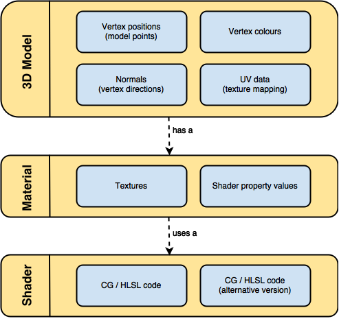

材质是表现shading的数据集，纹理贴图（图片内存+uv映射规则）和shader（程序）是实现这个目标的资源和工具。

| **英文**                                                       | **中文**  | **本质**         | **释义**                                                           |
|----------------------------------------------------------------|-----------|------------------|--------------------------------------------------------------------|
| ma[terial](https://www.wikiwand.com/en/Materials_system)       | 材质      | 数据集           | 表现物体对光的交互，供渲染器读取的数据集，包括贴图纹理、光照算法等 |
| [Texture mapping](https://www.wikiwand.com/en/Texture_mapping) | 纹理贴图) | 图像映射规则     | 把存储在内存里的位图，通过 UV 坐标映射到渲染物体的表面             |
| Shading                                                        | 着色      | 光影效果（表现） | 根据表面法线、光照、视角等计算得出的光照结果                       |
| [Shader](https://www.wikiwand.com/en/Shader)                   | 着色器    | 程序             | 编写显卡渲染画面的算法来即时演算生成贴图的程序                     |
| [GLSL](https://www.wikiwand.com/zh/GLSL)                       |           | 程序语言         | OpenGL 着色语言                                                    |

以模型为例，表示各个概念所在的位置：

参考文章：<https://www.uegeek.com/190608-material-texture-shaders.html>
