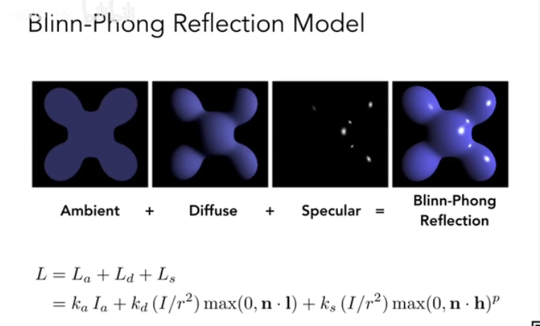

字典定义：

在绘画中引入不同的明暗和颜色。

在图形学上：

对不同物体引用不同材质。

## Blinn-phong Reflectance model

一种简单的着色模型

-   Specular hightlight：明面反射高光
-   Diffuse reflection：漫反射
-   Ambient lighting：环境光

### 着色的特性

-   着色是局部的
-   作用于一个特定的着色点

-   着色 不等于 阴影

不考虑遮挡性

### 漫反射

-   光线会被均匀的反射到各个方向去
-   各个方向看到的颜色都是一样的，与view向量无关

光线作为能量的话，物体表面（shading point）会接受多少能量？

光能力的衰减规律

与距离的平方（r\^2）成反比

漫反射接受到的光能量

-   I/r\^2：光到达在着色点的能量
-   max(0,n.l)：着色点接收到的能量（与入射夹角有关）(n点成l等于sinO)
-   Kd：漫反射系数，代表入射点吸收的能量系数

从公式可以看出，只要光源、物体表面不变，不管从哪个角度看，颜色都是不变的。

### 高光

特点：

-   依赖v向量
-   当v与反射R足够接近时可以看到高光

V与R足够接近，相当于半程向量h与法向量n足够接近，而且h比R容易算。

-   Ks：镜面反射系数
-   p指数：限制角度a，大于一定角度看不见高光，这样才符合现实

p指数解析图：

现实中p一般是[100,200]。

-   Ks越大，亮度越大。
-   p越大，高光越小。

### 环境光

不依赖于任何元素

任何方向观察都一样

-   Ka：环境光系数
-   Ia：设定的光能量系数

环境光在这个模型中是一个大简化，实际上真实的环境光需要用到全局光照知识。

着色点的计算公式

