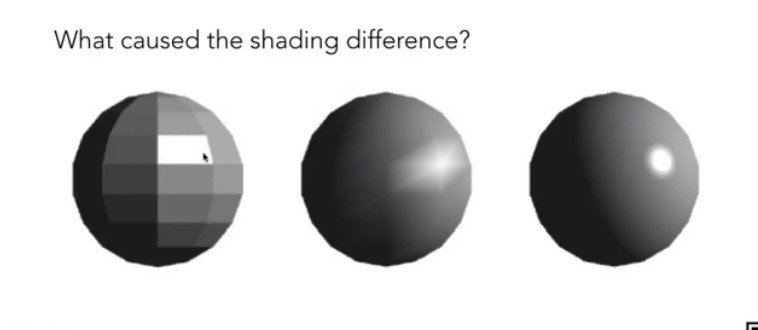
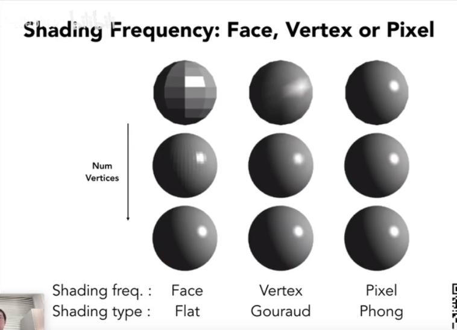
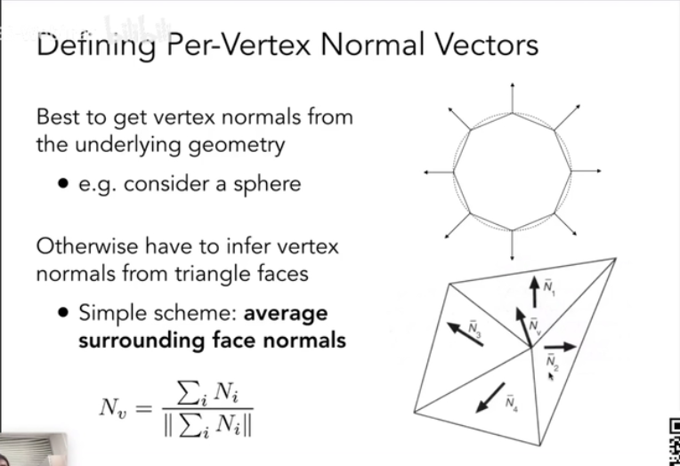
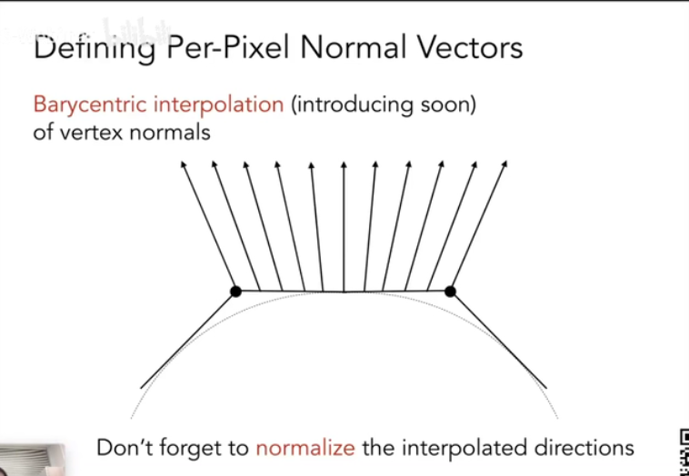

Shading Frequencies

着色频率影响渲染效果

三种着色频率：

-   对每个三角形面着色（Flat shading）
    -   三角形面容易求法向量
    -   平滑表面效果不好
-   对每个顶点着色（Gouraud shading）
    -   对每个顶点组成的三角形内插值颜色
    -   需要求出每个顶点的法向量（how）
-   对每个像素进行着色（phong shading）
    -   每个三角形之间插值法向量
    -   对三角形内的每个像素进行着色

对比

当模型三角形比较复杂时候，Flat shading的效果也比较好。

顶点的法线计算

-   为与该顶点相连的各个面的法线的平均。
-   各个面的面积加权平均计算得出的顶点法线会更好。

每个像素的法线计算

-   知道顶点的法线，那么两个顶点之间的法线可以在线段上的插值
-   这样可以得出边上点的法线，从而可以再通过插值得到三角形内部像素点的法线
