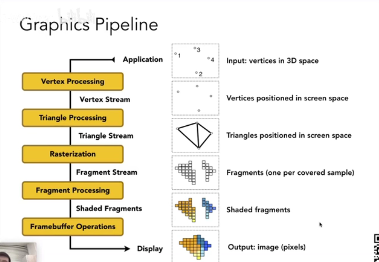
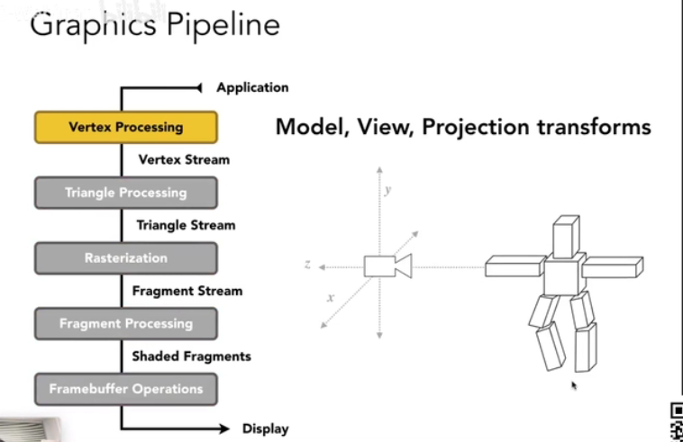
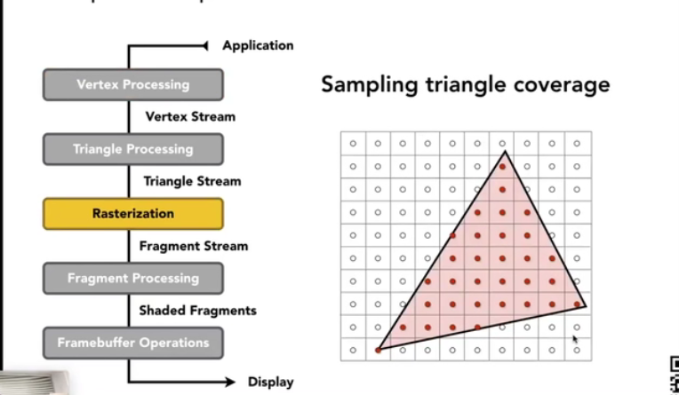
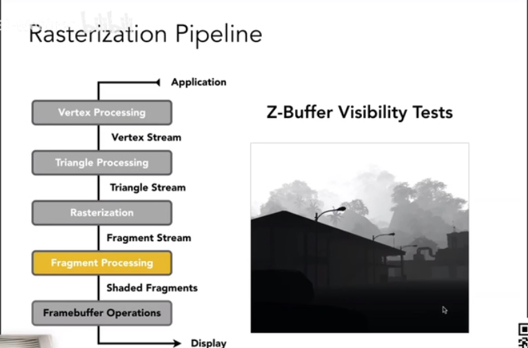
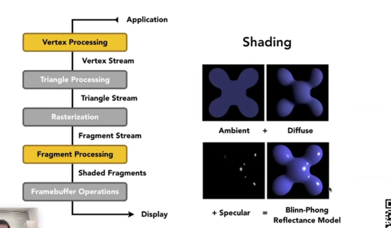
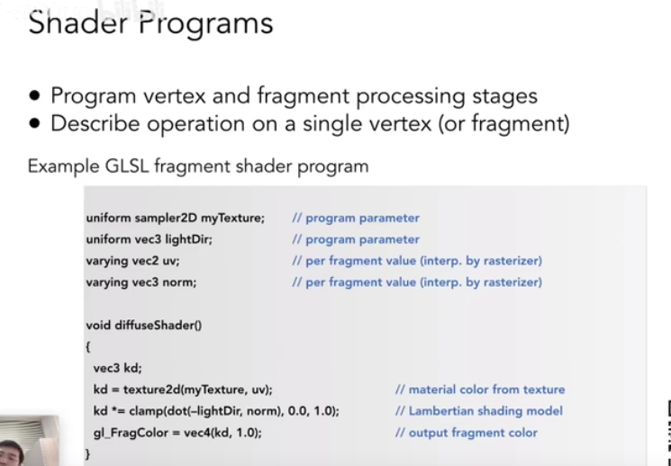
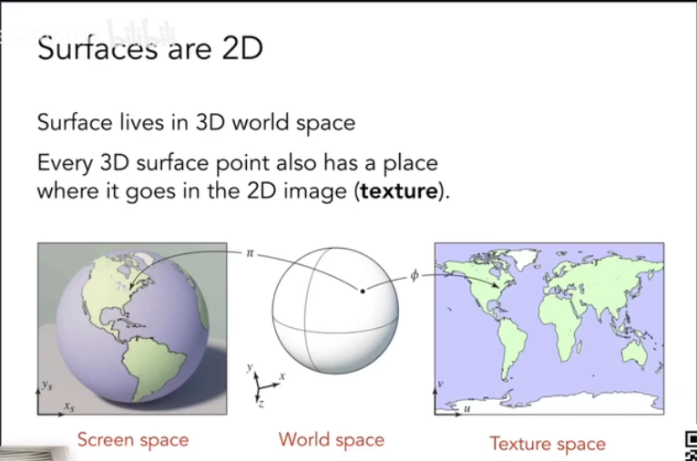
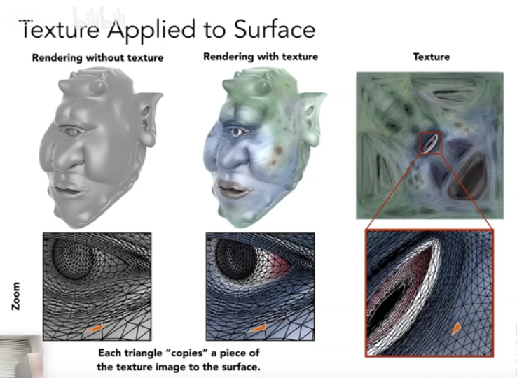
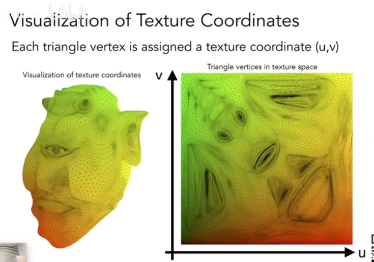

实时渲染管线

-   顶点处理：将3D中的顶点投影到屏幕空间
-   三角形处理：找出顶点组成的三角形
-   光栅化：采样出被每个三角形覆盖的像素部分（片段）
-   片段（像素）处理：对片段进行着色
-   framebuffer操作：显示图像

变换发生阶段

采样三角形覆盖阶段

z-buffer深度测试

shading阶段

考虑到不同的着色频率，shading可以反生在上述两个阶段。

shader编程

-   发生在顶点和片段处理阶段
-   描述每个顶点或者片段的处理方式

shader作品的网站：<https://www.shadertoy.com/>

纹理映射（Texture Mapping）

我们需要用来定义一个点的不同属性，比如颜色。

纹理：物体的表面其实是2D的，展开来就是一张图。

-   空间上的一个三角形映射到纹理上的一个块
-   换句话说是三角形的顶点映射到纹理上的坐标（u，v）

-   u，v的大小都是0到1
-   纹理可以被重复使用多次（瓦块）

纹理与着色的区别：纹理是着色时候定义的每个点的不同的属性。

着色与材质：不同材质就是不同的着色方法。
