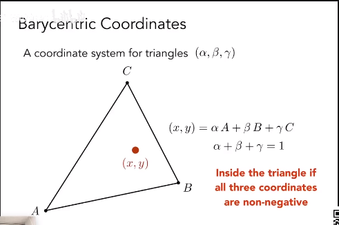
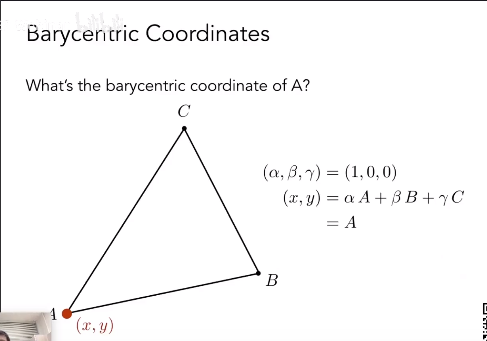
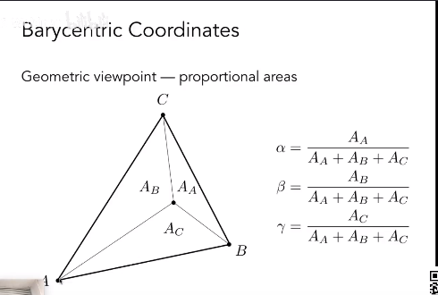
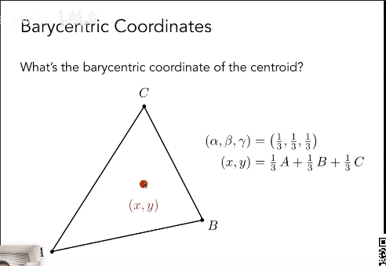
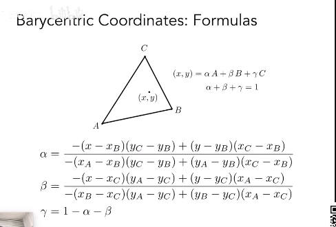
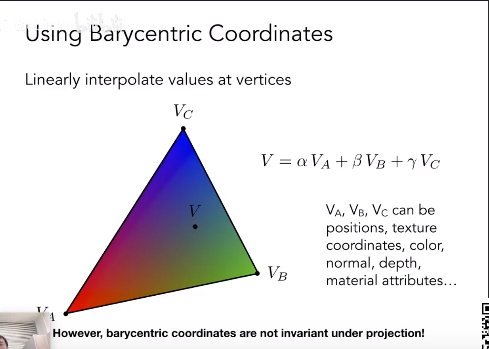

1.为什么想要插值？

-   着色应用于顶点
-   三角形内需要获得平滑的过度值

2.想要给什么插值？

-   纹理坐标
-   颜色
-   法向量

3.三角形内的属性如何插值？

利用重心坐标。

## 重心坐标

定义：对于三角形内的任何一点，满足上述公式，即是该点在三角形内的重心坐标（α，β，γ），属于一种新的坐标系。

## A的点重心坐标

## 重心坐标与面积的关系

可以推出重心的重心坐标

## 重心坐标与平面坐标系的关系公式

## 插值公式

## 

-   通过平面坐标系与重心坐标公式求出（α，β，γ）
-   VA、VB、VC可以替换成对应的属性，比如颜色、法线等

## 缺点

-   不能保证在投影下重心坐标不变

怎么处理投影的坐标属性的插值？

三维中的坐标属性，先在三维上做插值，然后对应到二维上，不能在投影上做。
