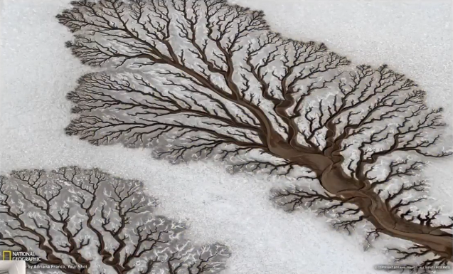
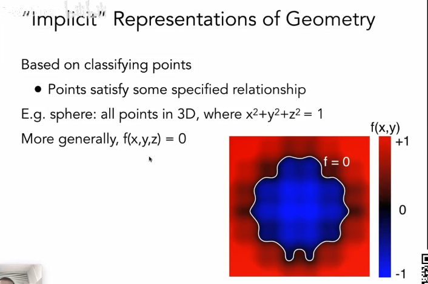

## 各种几何的例子

简单几何体、光滑表面、丝绸、毛发、城市规划图、水滴、显微镜下的细胞等等都是需要几何表述出来。

## 几何的表述方法

隐式Implicit

-   代数曲面algebraic surface
    -   水平集level sets
    -   距离函数distance functions

显式Explicit

-   点云point cloud
    -   多边形网格polygon mesh
    -   subdivision，NURBS

## 隐式几何

-   用公式描述坐标点之间的关系，不描述具体的点的数据
-   采样出左右满足公式的坐标很难
-   但容易知道点在几何内或外的位置，负在内，正在外。

## 显式几何

-   所有点可以通过参数映射的方式得到
-   u,v映射到坐标点
-   采样点相对容易，将所有的u,v走完，即可得出所有的点
-   判断点在几何内外关系相对难

由隐显式的优缺点可知道：最好的几何表述方法依赖于具体的任务内容。

## 隐式几何的几种方法

### 代数

可以表示一些简单的几何形状

### Constructive solid Geometry构造实体几何法

通过布尔运算组合基本的几何体

### 距离函数

对于任何的点，不描述它的表面，而是描述它到这个表面的最小距离

-   首先求出A物体的距离函数SDF（A）
-   再求出B物体的距离函数SDF（B）
-   最后将这个函数做一次blend操作blend（SDF（A），SDF（B））

距离函数还可以做很多事情，比如：

### 水平集Level Sets

跟距离函数做的事情是一样的，物体的融合和分离。

但是函数的表述方式不一样，它是通过grid记录一系列距离数值，找出中间等于0的相关部分

### 分形Fractals

跟递归很像，同种形状分形出更多的相同形状

渲染的时候容易引起走样，因为信号变化比较剧烈

## 隐式表述的优缺点

优点：

-   对存储友好，只需要公式表述（关系公式）
-   容易查询（内外，距离）
-   容易求光线相交
-   简单的图形
-   在拓扑学中容易处理变化

缺点：

-   困难表示复杂的图形（奶牛的例子）
