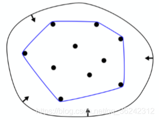

显式几何的表述方法：

点云

多边形

曲面

点云

-   一系列点（x,y,z）的集合
-   只要点足够密集，可以表示各种几何
-   但点的密度低就比较难表示一个面
-   最简单的显示表述方法

多边形polygon mesh

-   与点云不同，多边形网格除了存储点外，多了点与点之间的链接关系，也就是多边形（通常是三角形和四边形）
-   更复杂的数据结构（下图）
-   更通用于图形学中

多边形存储的数据结构：

一个文本文件记录了顶点v，法线vn，纹理坐标vt，链接关系f

## 曲线

### 贝塞尔曲线

#### 原理

假设有3个控制点b0，b1，b2，b0到b1和b1到b2视为1个时间单位，先从b0b1开始得出t时刻的点b01，同样的原理递归下去得出b11，b01到b11依然视为1个时间单位，找出t时刻点b02，这个是无法再递归下的唯一的点，这个点就是曲线上的点，这些连续的点就得出贝塞尔曲线。

#### 以上例子是最简单的2阶贝塞尔曲线，阶数等于控制点个数减1，多个控制点的曲线同样用一样的递归方法线性插值求t时刻点的方法得出曲线上的点。

#### 代数公式

先看3个控制点的代数公式推导

线性代数可以求出b01(t)=（1-t）b0+tb1，不能理解，当t=0时，位于点b0；t=1时，位于点b1

最终可以展开成多项式

通过这个多项式的规律可以求导出公式

这个多项式叫布恩斯特多项式。

#### 特性

1.端点不变性

始点和终点一定是两端的控制点

2.一阶导数特性

始点的切线（求导）等于n倍的b1-b0，；端点的切线等于n倍的bn-b(n-1)

3.仿射变换特性

曲线上每个点的仿射变换等于它的控制点做仿射变换后得出的曲线

但投影控制点后得到的曲线会更原来的不一样

4.凸包性质

曲线一定会在控制点形成的多边形内

### 分段贝塞尔曲线

分段是为了解决控制点太多难以控制曲线的问题，将曲线分割成多个小段曲线组成，通常每4个控制点控制一段曲线。

曲线间的链接处可能会出现不光滑，解决不光滑问题需要

-   控制连接点的切线在同一条直线
-   控制点到连接点的距离要相等（即导数要连续和大小相等）

（应用于字体、路径、插画Illustrator、基调keynote）

-   C0连续：相接，仅连续
-   C1连续：连续同时切线在同一方向且大小一样，连续且可导

### splines样条--贝塞尔曲线的扩展

-   通过一系列给定点的连续的曲线
-   相比贝塞尔曲线更容易控制
-   局部性，只是改变贝塞尔曲线的某部分很困难，因为改变控制点会影响整体曲线；而样条则允许改变局部。

B-splines

-   basis splines 的简称
-   比贝塞尔曲线要求更多信息
-   满足贝塞尔曲线有的所有特性

B-splines曲线讲解

## 

## 曲面

#### 从线到面

16个控制点，4条贝塞尔曲线，同一个时刻的曲线的点作为控制点得出一条曲线，这个曲线就是曲面上线，这条线从四条线的的始点扫到终点就可以形成面。

#### 计算方法

假设曲面用坐标（u，v）表示

-   通过u得出4条曲线上的4个控制点
-   代入v计算就可以求出点位置

u，v作为参数代入到贝塞尔曲线公式，这也就是说曲线是显式几何的原因。
