Mesh Operations网格操作：Geometry Processing几何处理

-   网格细分
-   网格简化
-   网格正则化

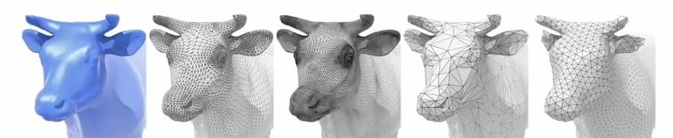

## 网格细分

模型的网格数量越多，模型就越逼真，相当于增加分辨率。

为了通过细分让模型表面变得更光滑，通常细分的规则包括：

-   创建更多的三角形（或顶点）
-   改变顶点的位置

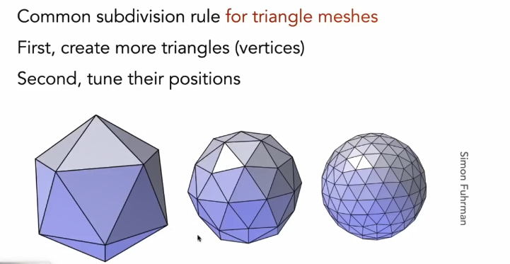

下面介绍两种细分方法。

### loop Subdivision（loop细分）

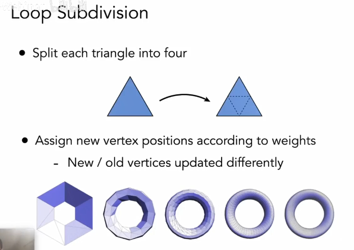

方法步骤：

-   以边的中点为分割点，将三角形分为4个
-   根据权重来调整新的顶点位置
    -   顶点分为新/旧顶点，用不同的方法更新

新的顶点的更新：

新的顶点是边的中点，下图的白点，位置受到同一个三角形上相邻的AB和不相邻的CD的影响，通过它们位置的加权平均得到。

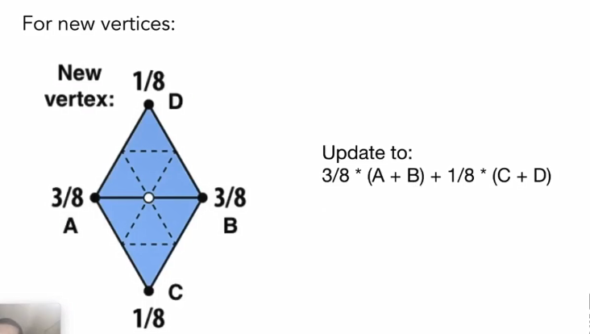

旧的顶点的更新：

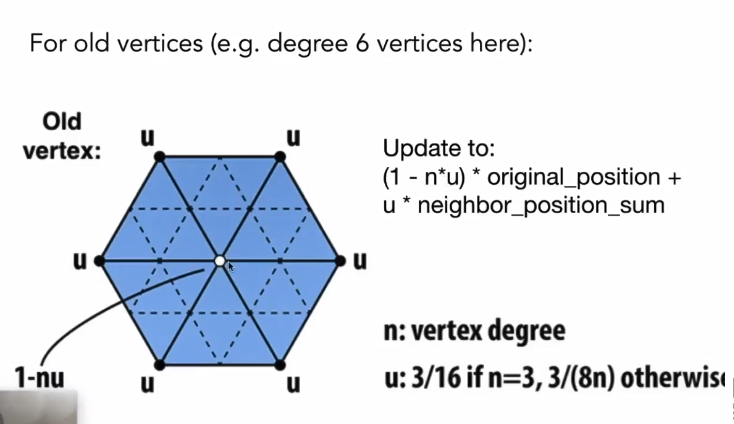

定义两个数：

-   n：顶点的度，即相连接的边数
-   u：一个权重，3/8 \* n

更新公式如上图所示，original_position表示白点的原始位置，neighbor_position_sum表示其相连点位置的和。

从公式可以看出，调整得出的位置受旧顶点和其连接点位置影响，但度越大，其自身位置影响就越小。

### Catmull-Clark细分

loop细分只是对三角形细分，C-C细分能对四边形网格细分，**更符合一般情况**。

两个概念：

-   非四边形面
-   奇异点，度不为4的点

步骤：

-   找出非四边形中心，作为新增的奇异点
-   四边形的边的中心，与奇异点连线

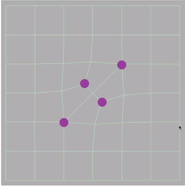

性质

-   经过一次细分后，增加的奇异点数为细分前非四边形数量，并且非四边形面消失。

多几次细分后，调整顶点位置，会变得越来越光滑：

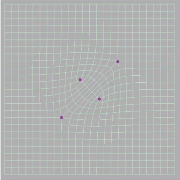

顶点更新规则

-   顶点分为三类：面顶点，边中点，旧顶点

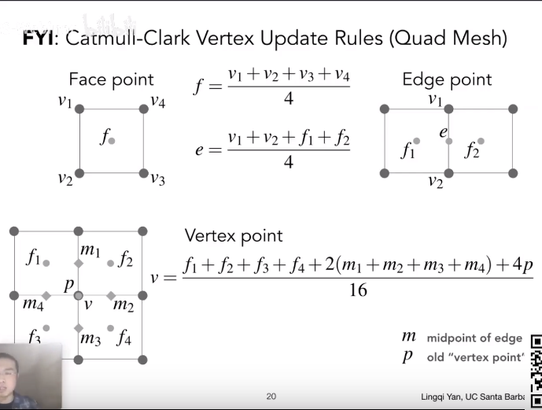

细分效果图

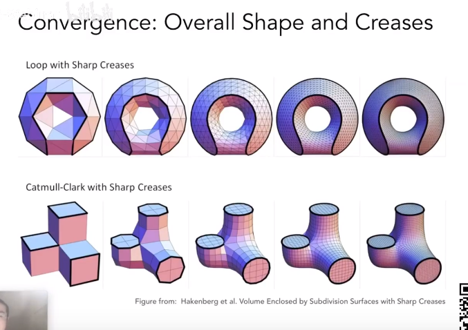

## 网格简化

目标：在保持整体形状的同时，减少三角形的数量。当模型在远处时候，可以隐藏细节，不需要太多网格。

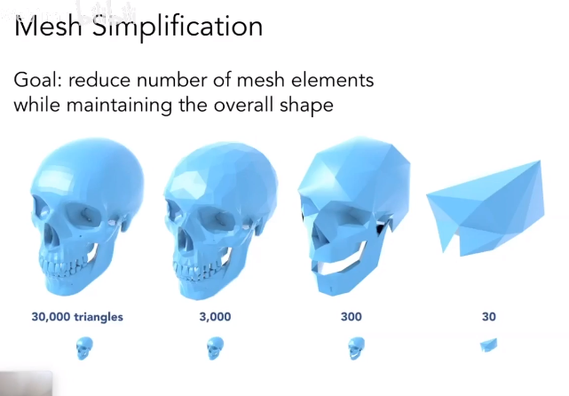

更mipmap很相似，距离远的模型选用高层的贴图，网格数量减少。

### 边坍缩

网格简化的方法--边坍缩

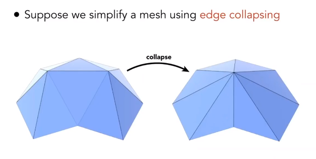

如何计算？--二次误差度量

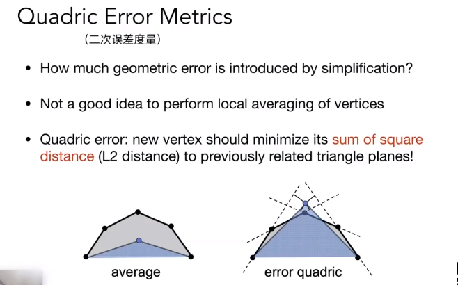

-   新顶点位置变化首先想到的是平均，左图，效果不好
-   二次误差：新顶点位置为其到相邻顶点面的距离平方和最小的位置

坍缩的问题？

-   坍缩哪些边？哪些边是重要的，不能坍缩的？那些边是不重要的，可以坍缩的？
-   坍缩选用哪种数据结构和算法

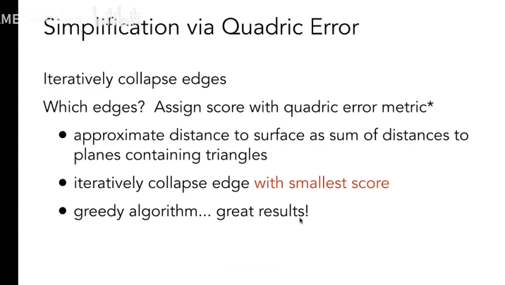

-   给每一条边打上二次误差度量的分数
-   选择分数最小的边开始坍缩
-   坍缩后有些边会有所变化，更新影响边的二次误差，再选出最小分数的边（优先队列，最小堆）

效果

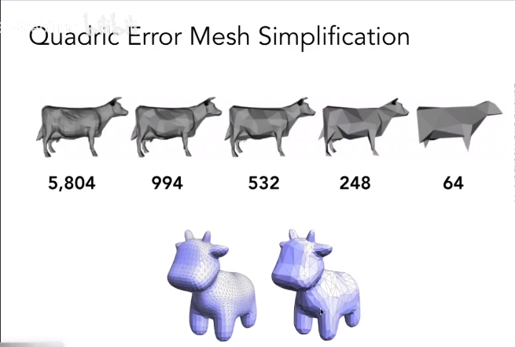

## 网格正规化

网格的三角形有大有小，对渲染会造成不便，希望改变三角形为正三角形，通过修改采样分布来提高质量。

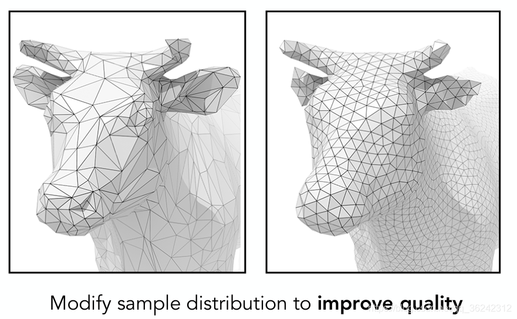
