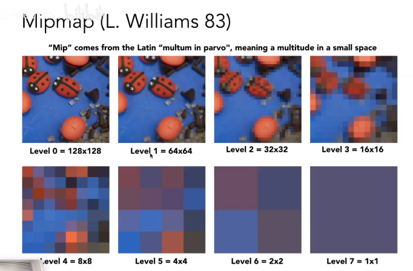
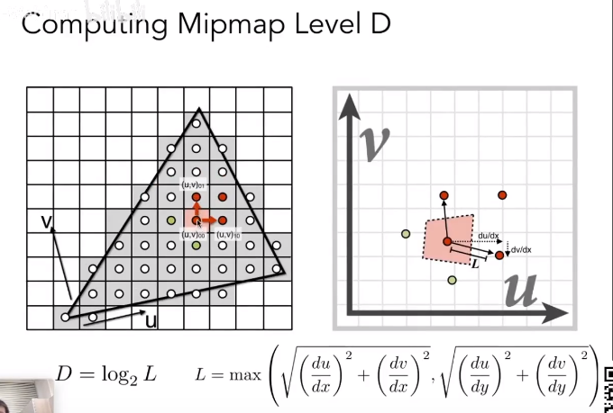

应用纹理

简单的纹理映射

-   每个上的每个像素点都有坐标x y
-   每个x y点通过重心坐标插值得到纹理坐标u v
-   在纹理上采样出u v的颜色
-   对颜色应用blinn-phong关照模型（通常是漫反射系数）

上述过程即是纹理贴在模型上的过程。

纹理反走样

纹理放大texture magnification（假如一个像素中的纹理太小）

即将小图放大的效果，学术名叫纹理分辨率不足

三种解决方法

-   Nearest（接近值，四舍五入）
-   Bilinear（双线性插值）
-   Bicubic

Bilinear

-   找出周围四个纹素
-   通过四个纹素的uv值做水平和竖直方向的插值

Bicubic

-   通过找出周围16个纹素，做双线性插值。
-   效果比bilinear要好，但是开销更大。

纹理放大（假如一个像素占的纹理太大）

点采样纹理存在的问题：

-   摩尔纹
-   锯齿

点采样纹理解析：指应用纹理的方法是通过像素中心查询纹理坐标，将纹理颜色值应用到像素。

产生的原因可以用之前走样的原因解析：

一个像素内占据的信号变化过快（包含区域过大），采样速度跟不上（一个点代表不了这么大的区域）

用反走样的方法：超采样解决

每个像素用512个采样点的结果。

超采样起作用的原因和另一种解决办法--区域查询

假如可以快速得出一块纹理区域的平均值（能代表区域的信号变化），也可以解决问题。

点查询vs范围查询

-   点查询：从一个像素映射到一个纹理坐标的值
-   范围查询：从一个像素映射到一个纹理区域的平均值

Mipmap

可以做快速的、近似正方形的范围查询

从一张原始图每次分辨率变成之前的四分一生成一系列的图，存储大小只是增加了原来的三分一。

每一层叠加组成纹理金字塔：

原理：

-   像素点映射到纹理上的区域，取上右两点间距离最大的L，画出像素在纹理上的近似正方形
-   用L计算出查询的层数D

D的计算公式解析：假如映射在纹理的正方形边长为1，则在第0层查；假如是2，则是1成查；假如是4，则是2层查。由此得出。

得出结果

但是由于查询的层是离散的，所以有不连续的效果。

怎么解决呢？三线性插值

在相邻两层查通过双线性插值得出的结果，再做一次插值。

得到的结果会更加连续：

两种方法的结果对比：

超采样

mipmap结果：

mipmap的局限会造成overblur。

另一种更好的方法：各向异性过滤（anisotropic filtering）

通过对比，可以知道各向异性过滤包含的图比mipmap多了横向和纵向的拉伸的矩形区域，比只能查询正方形区域的mipmap覆盖的查询区域更多。

像素点映射到纹理的区域并不都能近似成正方形：

EWA filtering：包含处理前两种区域，还能够处理不规则的矩形

