纹理在GPU上的本质

texture = memory + range query（filtering）

从这个角度理解纹理映射就是：将数据带到碎片计算（贴到三角形上）的通用方法

多种应用：

环境光

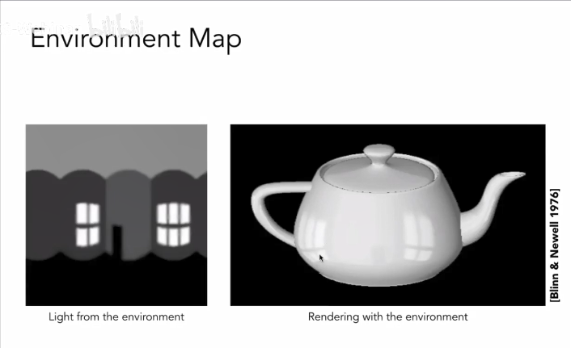

-   纹理可以用来表述环境光，并且映射到模型
-   记录环境光的方向信息

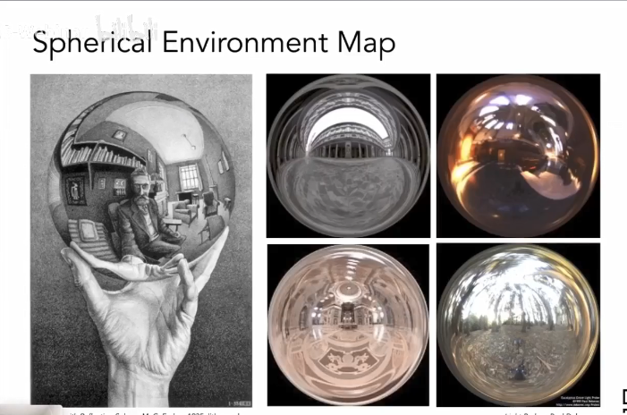

-   把环境光记录到球面上，并且展开

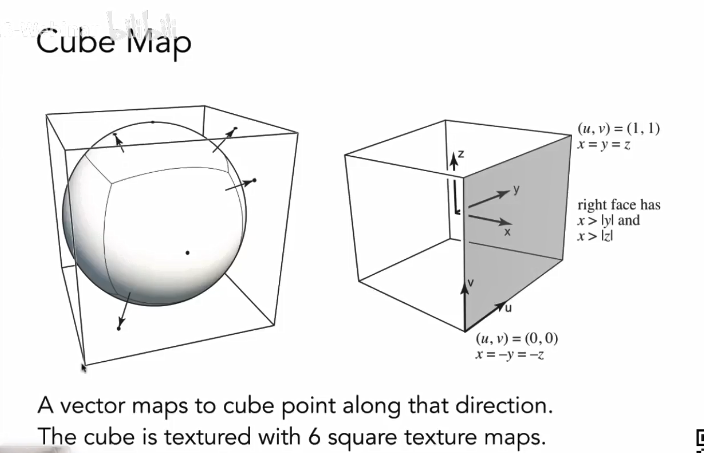

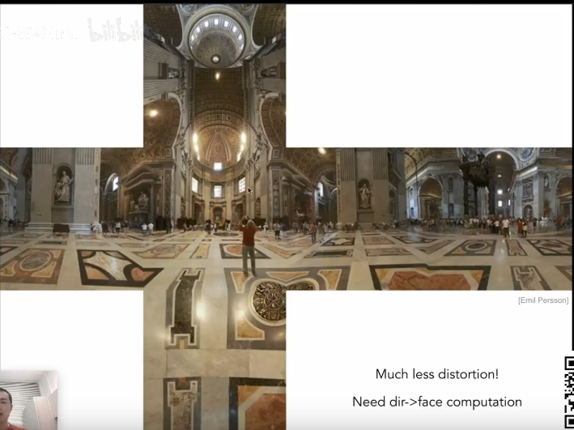

-   将环境光信息记录到cube表面上

纹理影响shading（凹凸贴图Bump Mapping）

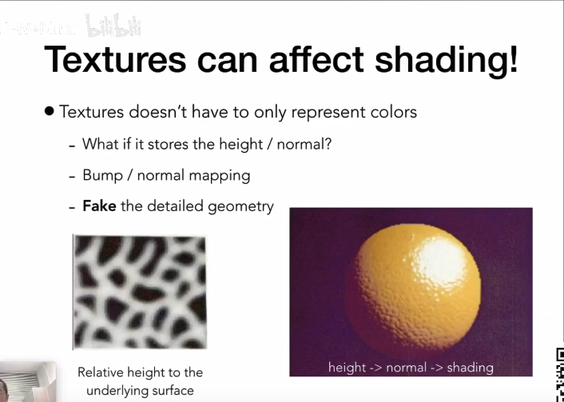

-   存储每个顶点的相对高度信息
-   高度影响法线方向，从而影响光照到表面的明暗程度

Bump mapping凹凸贴图

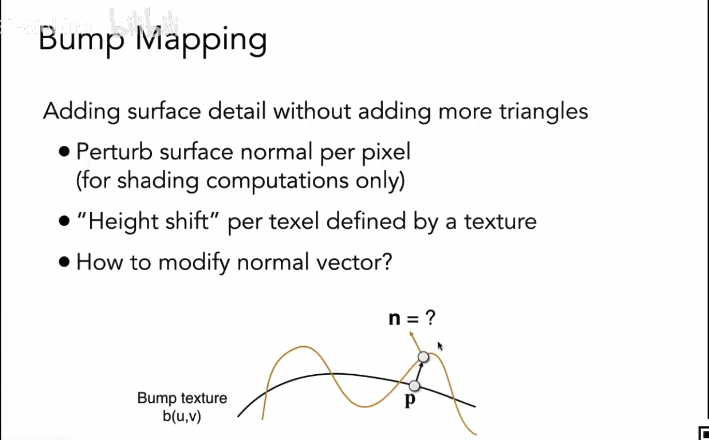

-   不增加三角形
-   扰乱每个像素的表面法向量

如何改变法向量

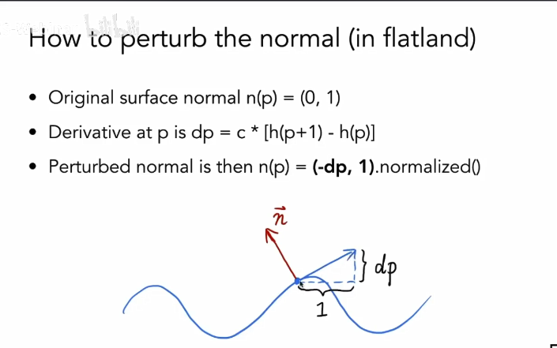

-   两点位置求切线
-   法线垂直于切线，做90°的旋转

Displacement mapping位移贴图

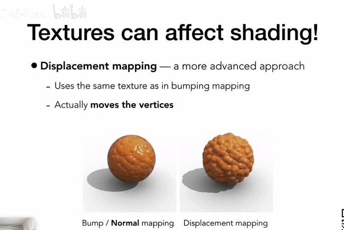

-   使用跟dump mapping同样的贴图
-   真实移动了顶点
-   物体边缘的效果比dump mapping要好

3D贴图：3D噪声+实体造型（3D Procedural Noise + Solid Modeling）

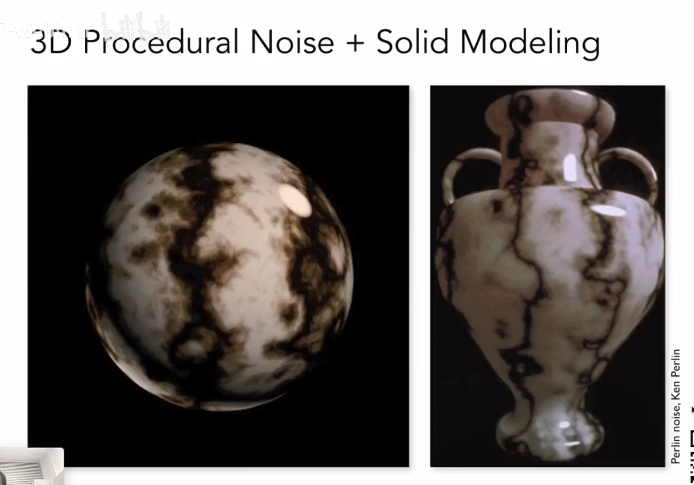

-   并不会生成贴图，而是定义一个3D噪声函数，生成空间中每个点对应的值（这个值应该就是贴图的值吧）
-   通过噪声函数还可以做各种不同效果

Provide Precomputed Shading提供预计算的Shading

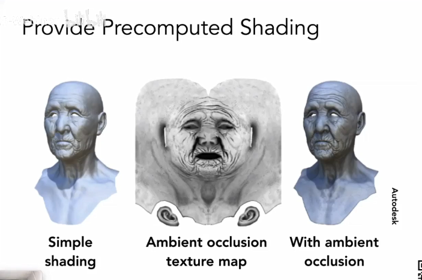

-   将阴影效果预计算好
-   乘以贴图值，合成在贴图上（相当于静态的阴影效果）

3D贴图和体积渲染

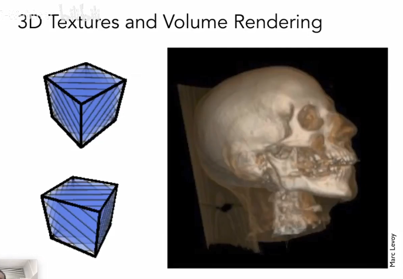

-   3D贴图广泛应用在体积渲染上，在医学成像仪器用得比较广，核磁共振等等
