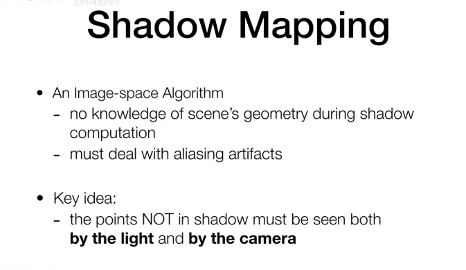
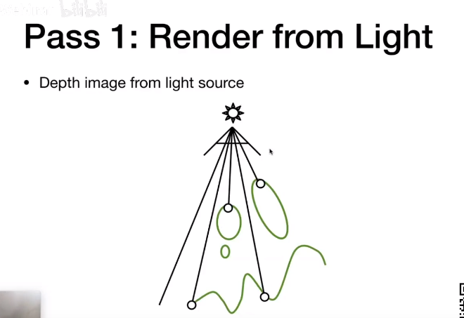
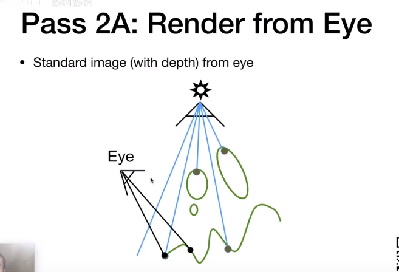
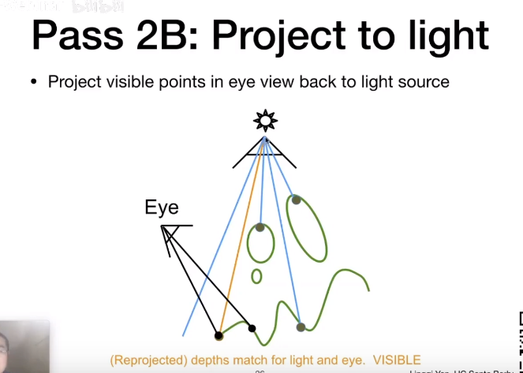
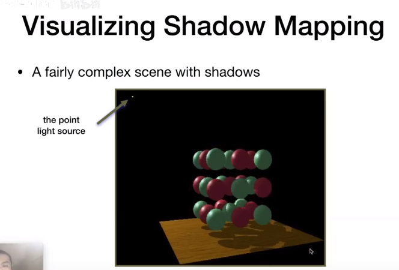
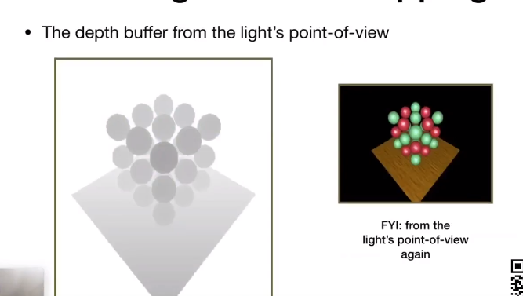
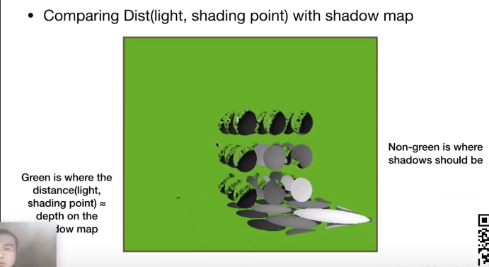
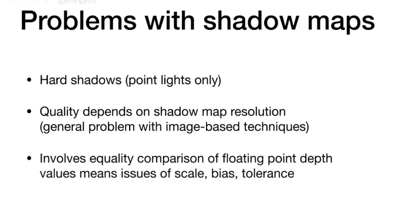
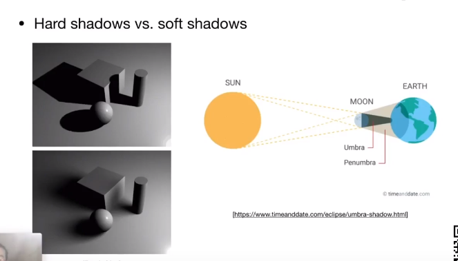

## shadow mapping：解决在光栅化化上画出阴影

属于一个图像空间算法，不需要知道几何信息，但存在走样问题

关键点：

-   一个点不在阴影内，那肯定会被光源和摄像机看见

## 步骤

①以光源位置假设有摄像机，生成深度图

②A在真实摄像机上生成带深度的标准图

②B将标准图的点投影回光源生成的深度图上，对比深度，相近（浮点数相等问题）的则不在阴影内，不同则在。

## 例子

①光源处生成的深度图

②摄像机处从生成像素上投影到深度图上的点，对比深度，生成shadow mapping

-   绿色上的点表示光源看到的点
-   非绿色点表示阴影

## 问题

-   属于硬阴影，仅支持点光源
-   质量依赖shadow mapping分辨率
-   浮点数比较问题

## 软阴影和硬阴影的对比

