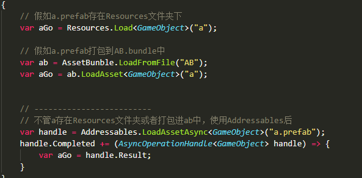
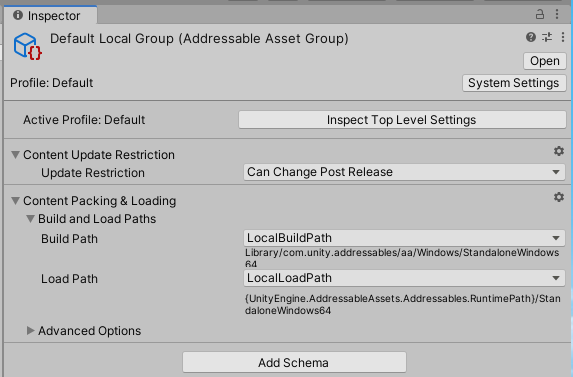
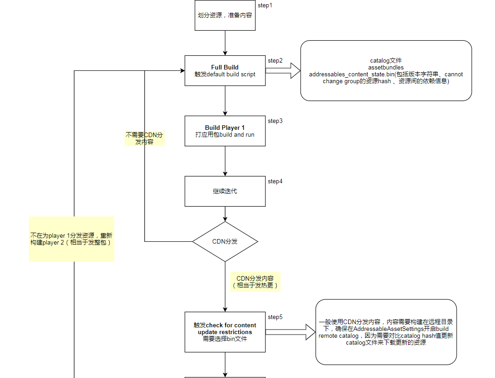
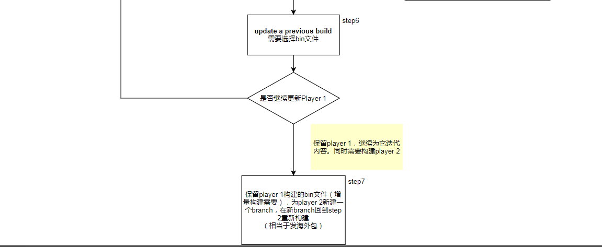
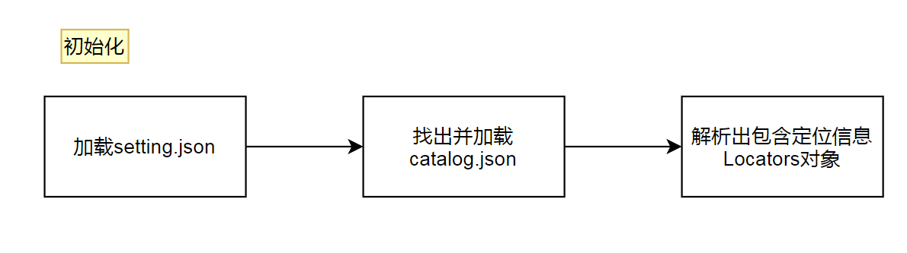
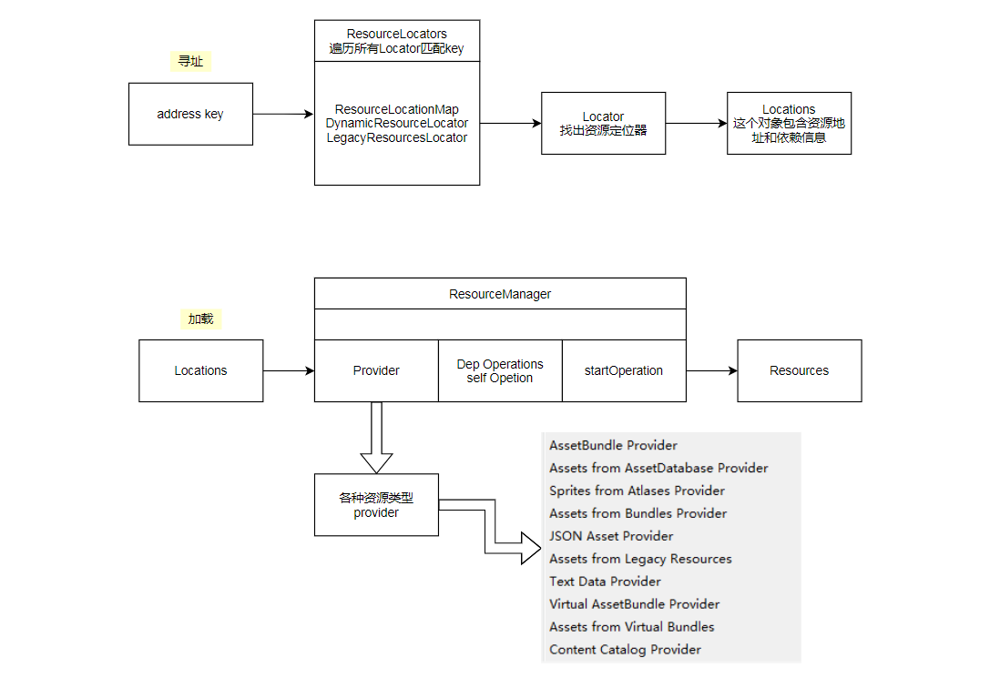

# Unity Addressable Asset System介绍、教程和原理讲解

## 1. 背景（怎么来的）

Unity Addressable Asset System是官方推出的资源加载和资源管理的一套解决方案。

它使用异步加载的方式加载资源，提供统一的加载接口，不管资源放在哪个目录，不管资源的依赖有多复杂。

传统的资源管理方式严重将组织、构建、加载Asset的逻辑捆绑在一起，比如

1. 资源存放在Resource文件，那加载资源必须要用到Resources.Load方法，并且提供资源路径
2. 加载ab中的asset时，加载代码需要和构建策略捆绑在一起，先找出资源对应的bundle加载完成后，再加载需要的资源。
3. 以路径加载的代码，当资源路径发生改变往往要多次更改代码，这个更改可能涉及多处。
4. 资源位于远程，需要写代码管理资源的下载、加载、卸载和缓存。

基于以上种种不便，Unity Addressable Asset System（下文称AA系统）的一个重要好处就是解决以上种种痛点。
## 2. 特点（有何用）
- 快速迭代：解耦组织、构建、加载Asset的逻辑，通过[address]和统一接口加载资源，不管资源放是否来自Resources目录，或者将来重命名或者路径变更，不管资源如何构建，都不用再修改加载代码。
- 依赖管理：当加载一个资源的时候，AA系统会先加载完这个资源的所有依赖，然后再返回这个资源。
- 内存管理：自动管理资源加载卸载的引用计数，并提供工具探测内存泄露问题。
- 内容打包：当资源变更时能够有效打包资源，更容易管理本地和远程打包资源和有效减小应用大小。
- 配置文件：统一管理资源如何打包的变量，避免配置分散多处修改问题。

## 3. 概念

### Group

group定义一组在构建时可处理的Addressable Asset集合。

默认有两个group，如上图：

- Built In Data。内置的group，包含Resources文件夹，这个group不支持修改。
- Default Local Group。在Inspector标记Addresables的Asset会默认添加进这里，支持修改，包括改名和添加Schema。

### Group Schema

group schema定义一组分配给group在构建使用的数据，可视为配置数据，决定group中Asset如何打包、打包粒度等等。

点击group，查看这个group中添加的schema，和schema的配置：

包括三种Schema：

1. Content Updage Restriction 主要决定ab可不可以更改
	Update Restriction：决定改组内容打包成ab后，可不可以动态更新。can change post release：允许发布后变更；cannot change post release：不允许发布后变更。
2. Content Packing & Loading **决定打包方式和加载的配置**，包括构建目录、压缩、打包模式等等
	下面是几个重要的配置，鼠标移动到变量名上可以显示该配置作用介绍：
	Build Path：打包后的发布路径。可分为本地和远程路径。
	Load Path：加载ab的路径，可分为本地和远程路径。
	这些的路径变量来自Profiles中定义的变量，Profiles的解析请看下面。
	Compression：支持三种压缩方式，包括不压缩、LZ4和LZMA。
	Include In Build：勾选才会将该group纳入构建进程中。
	Use Asset Bundle Cache：勾选会将加载的ab加进缓存目录中，远程bundle才需要勾选。
	Bundle Mode：打包模式，分别是Pack Separately单独打包，Pack Together全部达成一个包，Pack Together By Label根据label划分打包。
	Bundle Naming：bundle的命名规则。
	Asset Provider：加载和解析Asset的类，不同的资源类型对应不同的provider。
	Asset bundle Provider：加载和解析Asset bundle的类，默认为AssetBundleProvider。
3. Resources and Build In Scenes** 是否将Resources和Build Setting Scenes包含进来打包**
	Include Resources Folders：是否将Resources文件夹下的Asset包含进group。Resources下的Asset会打包进包体，一般不需要勾选。
	Include Build Setting Scenes：是否包含Build Setting添加的Scenes。

### Addressable Asset Settings

作为AA系统全局的配置文件，在初始化的时候生成。以下介绍几个重要的变量：

属性介绍：

Disable Catalog Update on Startup：勾选则在AA系统初始化时候不检查catalog文件更新。

**Build Remote Catalog**： 勾选则生成远程ab的catalog文件，需要配置remote catalog文件的build path和load path。

Send Profiler Event：勾选则开启分析器。

Unique Bundle IDs：给bundle分配独一无二的ID。因为catalog文件可以在初始化以外的时候更新，当旧资源已经在内存中时，但unity无法下载两个同internal name的资源，这种情况资源无法及时更新。要么先卸载重新资源重新下载，要么分配给bundle单独的id来区分。开启这个选项，当资源更新时不仅仅是更新该资源，也会更新依赖链，带来一定的性能花销。

Contiguous Bundle：基于源资源的排序来排序Bundle，可以加快Asset加载速度。

**Build and Play Mode Scripts**

Use Asset Database （fastest）：加载源文件模式，不用打ab和分析。

Simulate Groups（Advanced）：模拟组模式，以不打ab方式来分析内容的布局和依赖。用类似加载ab的方式，通过ResourceManager从AssetDatabase加载。这个模式用于模拟加载策略，调整和平衡内容的分布。

Use Existing Build：使用构建好的ab加载，需要提前构建好ab。

Default Build Script：默认的构建脚本。

可选的Build Script都是ScriptableObject的Asset。假如需要扩展，可以新建脚本，继承IDataBuilder接口。添加可以选择左下角+，添加Build Script Asset。

前三个Play Mode Script分别对应Assetables Groups-》Play Mode Script下的三个模式。

Default Build Script对应Assetables Groups-》Build-》New Build-》Default Build Script。

Asset Group Template：group模板，Assetables Groups面板下Create→Group下，或者group右键菜单可以选择。在Project面板目录上右键菜单Create-》Addressables-》Group Templates-》Blank Group Template可以创建模板。

## 4. 使用流程（怎么用）

### step1 安装

到Package Manager安装以下两个package：

- Addressables，基本包，本文章使用的版本是1.16.15
- Scriptable Build Pipeline package，依赖包

### step2 初始化

安装包后，通过菜单栏Window->Asset Management->Addressables→Groups 可以打开AA系统的管理面板

未初始化会出现初始化按钮，点击后Asset目录下会出现一个AddressableAssetsData目录，存放着一些配置文件。

### step3 标记可寻址

需要将Asset标记为Addressable，才能纳入AA系统的管理。标记为Addressable Asset有两个途径：

通过Inspector。勾选，会将Asset添加进默认的group（Default Local Group），以相对Assets目录的地址作为AA系统寻找该Asset的【address】，这个地址支持修改。

1. 拖动Asset进group。
### step4 配置远程打包路径
unity官方推荐新建一个profile为hosting service所用，配置正确的build path和load path，可以上可以填上Hosting Service 变量：
并在需要在AddressableAssetSettings上开启构建远程catelog，选用Editor Hosted Profile，选择build path 和 load path：
Addressables Group面板上选择Editor Hosted Profile
最后在group Inspector面板中选择内容构建输出的目录，若为远程资源则选择RemoteBuildPath。
这就配置完了Hosting Services的使用流程。
### step5 打包
前面已经了解到Group Schema控制打包方式，主要用到两个Schema：content update restriction 和 content packing & loading
打出的ab类型可分为远程和本地，静态和非静态（can change post release为非静态）。两两结合可以分为四个组，每个组下各包含两个资源：
点击Addressables Groups菜单栏build-》new build-》default build script，开始构建。
ab构建完成后，可以看到本地ab和远程ab分别打包到了各自的目录：
local和remote各自有一份catalog json文件，remote多了一份hash文件，记录catalog文件的hash值，用于判断catalog文件的更新。
catalog文件里记录了address到资源的映射关系，用于定位资源和决定如何加载资源（where和how），每当资源发生变动后构建完成时，catalog文件重新生成。
### step6 更新
再看看更新资源后，各组间的资源打包后如何组织？
每个组更改第一个资源后，点击Tools-》check for content update restriction，检查更新
这时候会打开窗口选择addressables_content_state.bin文件，文件位于Assets/AddressableAssetsData/[platform]下，发布哪个平台选择哪个平台，一般是Android和Windows。
为什么要选择这个bin文件？
使用过BuildPipeline构建ab都知道有个manifest文件记录资源间依赖关系，AA系统会将资源间依赖关系记录进这个bin文件，作为对比找出更改的资源。
这步过后，会检查出更改的资源：
为什么所有资源都有更改，只检查出两个有更新，并且两个资源都来自静态组？
unity推荐打包内容分两种类型：
- can change post release：期望更新的动态内容。一般打成小包，以控制精准更新，减少包中其他没有更新的资源的不必要更新。
- cannot change post release：不期望更新的静态内容。一般打到一个很少更新的大包中。

addressables_content_state.bin文件只是记录了静态资源的hash和依赖关系，动态资源的依赖关系动态计算没有记录到bin文件中，所以check for content update restriction只是作用于static组，对nonStatic组没有作用，也即是对设置了can change post release的组没有作用。

点击apply changes按钮，groups会出现变化：

static组中更改的资源会移动到一个新组content update group：

content update group属于remote non static组

点击build-》update a previous build，选择刚才的bin文件，增量更新

对比发现：

catalog json和hash文件会更新，被重写。

静态组资源bundle并不会被重写更改或者重生生成，静态组中更改的资源会被移动进content update group重新打包到remote目录。

非静态资源组的bundle包虽然不会被重写，但是会被重新生成，hash值也会更新。

旧的非静态资源组bundle会在catalog文件中失去连接和记录，成为无效资源（这个无效资源会保留在用户设备上成为垃圾资源，应该要有个机制及时清理）。

note：每次full build，bundle和catalog文件会重新生成，localBuildpath目录会清空，但是remoteBuildPath目录并不会清空，新生成的资源会跟旧资源混合。

用一张图来阐述官方推荐的AA系统资源更新生命周期：

## 5. 工具

### Profiles

通过菜单栏Window->Asset Management→Addressables→Profiles 或者 group面板的菜单栏tools→Profiles 打开Profiles面板。

这个是AA系统用来管理一组组变量的解决方案。

默认有以上5个变量，见名知义。

从变量的值中发现有两种符号：[]和{}。

[]：定义编辑时的变量。比如UnityEditor.EditorUserBuildSettings.activeBuildTarget，在编辑时就可以得到的值。

{}：定义运行时的变量。比如UnityEngine.AddressableAssets.Addressables.RuntimePath，在运行时才知道值。

左上角可以添加变量和Profile，在变量上右键可以删除和更名变量。

在AddressableAssetSettings Inspector上可以选择使用哪一份Profilles，这里使用Default Profiles。

### Hosting Services

AA系统提供本地资源服务器，模拟远程资源加载。被设计的目的是为了在测试打包内容时加快迭代速度，不需要另外写一套远程资源下载加载代码。它能够为本地或者远端的客户端提供内容。

Addressables Groups-》tools-》Hosting Services-》Create-》Local Hosting创建本地资源服务器：

勾选Enable会分配端口号启动服务器，也可以指定端口号。

开启后，hosting services会以每个group的build path为资源目录提供内容。

### 内存管理memory management

AA系统通过Addressables API来管理资源的引用计数，提供Event Viewer工具监测资源对象被引用和内存占用情况。

Addressables常见的资源加卸载API：

- Addressables.LoadAssetAsync & Addressables.Release 
- Addressables.LoadSceneAsync & Addressables.UnloadSceneAsync
- Addressables.InstantiateAsync & Addressables.ReleaseInstance

写段测试代码观察资源的引用情况：

using UnityEngine;

using UnityEngine.AddressableAssets;

using UnityEngine.ResourceManagement.AsyncOperations;

public class Loader : MonoBehaviour

{

private void OnEnable()

{

InstByLoadAssetAsync("Assets/Local_static 1.prefab");

InstByLoadAssetAsync("Assets/Local_non_static.prefab");

InstByLoadAssetAsync("Assets/Remote_static 1.prefab");

InstByLoadAssetAsync("Assets/Remote_non_static.prefab");

InstByLoadAssetAsync("Assets/Local_static.prefab");

InstByInstantiateAsync("Assets/Local_static 1.prefab");

InstByInstantiateAsync("Assets/Local_non_static.prefab");

InstByInstantiateAsync("Assets/Remote_static 1.prefab");

InstByInstantiateAsync("Assets/Remote_non_static.prefab");

InstByInstantiateAsync("Assets/Local_static.prefab");

}

private void InstByLoadAssetAsync(string address)

{

AsyncOperationHandle<GameObject> handle = Addressables.LoadAssetAsync<GameObject>(address);

handle.Completed += OnLoadDone;

}

private void OnLoadDone(AsyncOperationHandle<GameObject> handle)

{

Instantiate(handle.Result);

}

private void InstByInstantiateAsync(string address)

{

Addressables.InstantiateAsync(address);

}

}

play mode script选择use existing build，因为use asset database 模式没有统计资源依赖数据（实际上只有fps和Monoheap），线上是ab加载模式所以数据更加准确。

通过tools-》Event Viewer打开面板：

- FPS: 帧率
- MonoHeap：内存占用
- Event Count：每帧事件数
- Instantiation Counts：通过Addressables.InstantiateAsync实例化的资源
- Resource Request：每个资源的引用计数

注意：当资源的引用计数为零时，并不代表该资源被回收，比如AB中的a资源引用未0，但AB自身的引用不为0，AB未被释放所以a也未释放。

## 6. 代码层加载资源过程（如何实现）

第一步初始化，加载catalog文件，解析出资源定位信息。

接下来的过程可以简单分为两步：寻址和加载。

1. catalog文件会被加载并解析得出所有的Locator对象，Locator对象包括资源及其依赖的信息。
2. 遍历所有的Locator对象，匹配address key，找出对应的Locator，Locator下包含了资源的Location对象，这个对象管理资源地址及其依赖信息。
3. ResourceManager类根据Locations对象上记录的ProviderId找到Provider对象，调用返回自身和其依赖的异步操作对象AsyncOperation，执行异步操作加载资源通过回调函数返回。

**Location对象：**

可以看到上面记录的InternalId，Dependencies、ProviderId、LocatorId等信息。

catalog文件中记录有LocatorId，能被它解析出map信息：

**参考资料：**

Addressables官方文档

Addressable Asset System

[Unity Adressable Asset System介绍、教程和原理讲解.ppt](file/Unity%20Adressable%20Asset%20System%E4%BB%8B%E7%BB%8D%E3%80%81%E6%95%99%E7%A8%8B%E5%92%8C%E5%8E%9F%E7%90%86%E8%AE%B2%E8%A7%A3.ppt)

