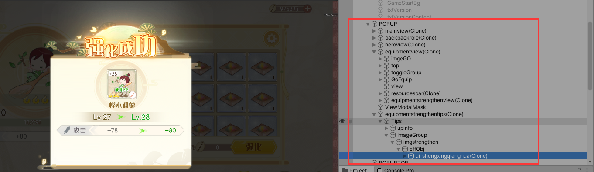
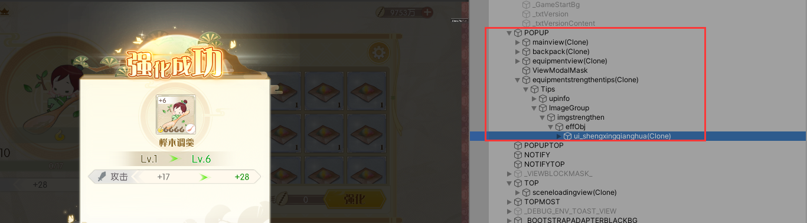

# CanvasRenderer数量限制问题

最近发现UI上的一个问题，得出以下结论：

一个Canvas下的CanvasRenderer组件数超过1024时，后面的CanvasRenderer只会渲染mesh的第一个，假如CanvasRenderer有两个mesh要渲染，第二个则不会渲染。

最近项目中引入UIParticle，当Canvas上打开界面越来越多时，发现UIParticle显示不全，而该UIParticle在界面不多的时候则显示正常。

界面比较多，UIParticle特效显示不全：

界面少，UIParticle特效显示正常：

一下做了一些探索：

*   通过多次显隐元素，发现隐藏ScrollView节点，消失的特效会显示正常。

*   怀疑ScrollView上的组件引起，隐藏后发现无影响。

*   怀疑mask遮罩引起，结果发现无影响。

*   通过打印UIParticle组件的submesh输出，发现submesh数量在显示正常和不全的情况下一致，2个。

*   用farme debugger查看发现，正常时有两个mesh渲染，而不全时只是渲染了一个mesh。

*   调整UIParticle下粒子渲染顺序，将消失的例子排列在前，发现消失的粒子显示，而另一个mesh的粒子消失。

*   换成另一个一样有两个或多个submesh的UIParticle，结果也是会显示不正常，而关了有ScrollView节点的界面，显示正常。

结合上面的探索，深入思考，跟UI元素数量有关，而UI元素渲染在canvas上显示，是CanvasRenderer负责的，可能是跟它的数量有关。

于是做了个实验来验证，在新项目上，探索随着CanvasRenderer数量增加，UIParticle的显示情况。

demo：

[uiparticle\_debug\_demo.rar](file/uiparticle_debug_demo_-Bob1e0Is_.rar)

结果验证了猜想：当CanvasRenderer数量超过1024个时，UIParticle粒子显示不全，当一个CanvasRenderer有2个submesh情况下只有一个被渲染。

CanvasRenderer的实现属于Unity内部不公开的源码，无从探索。谷歌和Unity论坛上搜索无果。

以上展示了对于使用未知框架结合项目中出现的奇怪问题的思考过程，大概思路是：先尝试对比正常和不正常的同异点（go数量），横向纵向搜集更多信息，对比和进一步深入思考信息的关联点（Canvas上的渲染跟CanvasRenderer有关），进一步做假如然后用实验来验证。

中间可以跟同事交流，多和几个同事交流。
