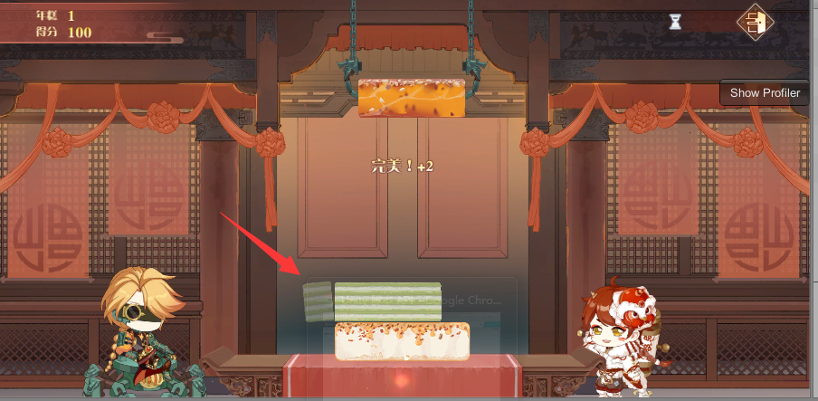
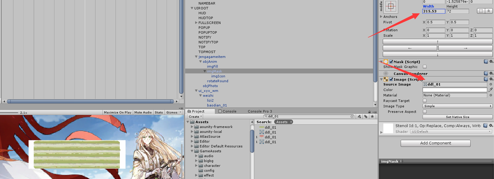

# 叠叠乐小游戏

## 摇杆的移动

摇杆以椭圆作为运动轨迹，利用椭圆公式求出坐标

```lua
x = a*cos(rad)
y = b*sin(rad) 
```

## **年糕切面效果**



1.  mask遮罩背面多加一个image fill，设置fill方向，设置amount隐藏丢与mask层重叠部分

2.  设置mask的新宽度，使露出image fill层

3.  以切面底部点为旋转原点，然后旋转帧动画，模仿掉落状态

```lua
self._imgFill.transform:RotateAround(self._rotatePos,Vector3.forward,self._rotateSpeed*Time.deltaTime)
```

&#x20;4\. 使用DOTween库做消失过渡动画

```lua
self._tween = Pjg.CSTweenUtils.DOTweenFade(self._imgFill.transform,1,0,Time.deltaTime * self._frameCount,nil,nil)
```

## **图片切割后切面实现圆角**



利用mask组件，该组件用于遮罩子组件，遮罩形状可以设置该GameObject上的Image的source Image为圆角图片，所以改变GameObject 的width后会有圆角效果，这里设置为子元素的sprite即可。

```lua
self._imgMask.sprite = self._imgIcon.image.sprite
```

## 落地回弹效果

利用unity的动画系统实现，Animator组件。
