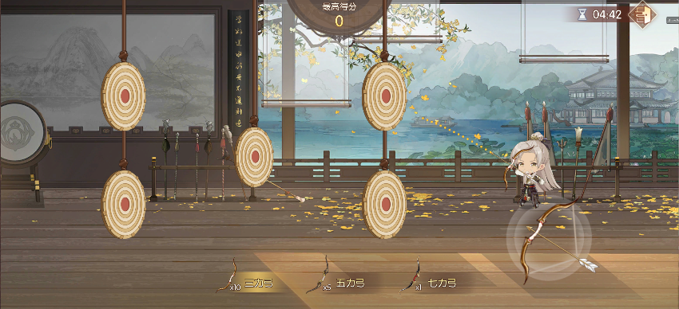
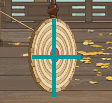
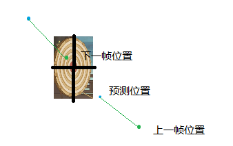
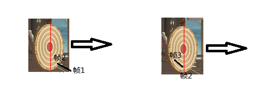
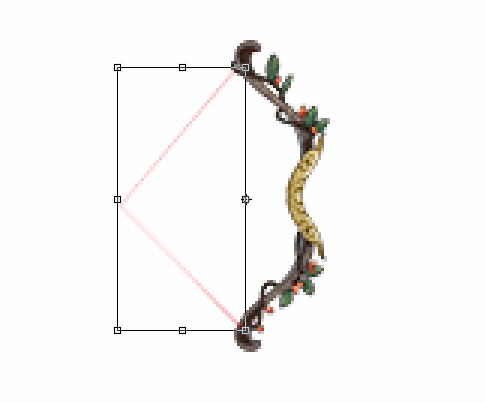

# 射箭小游戏



### 碰撞检测

属于2D游戏，没有深度，碰撞检测采用判断两线段是否相交的方法，即箭头两帧之间位置线段与箭靶中心为原点的xy轴中心线两线段。



之所以选择这种判断方法，是因为中靶的位置是算分数的一个因素，不能像射气球那种带碰撞盒的方式，箭进入碰撞盒后就会立刻停止。这样的得分效果不好，只能拿到击中边缘的3分。

假如两帧的线段同时与两中心线相交，优先取与y轴平行的中心线交点，因为箭停留在靶上的效果较好。

实际效果发现与x轴平行的右半段，会很大概率挡住箭射中Y轴中心线，这样效果不好。右半段是为了托住箭避免没中Y轴线而穿靶，所以可以加个检测前提。

#### 关键代码

判断二维平面两线段是否相交代码：

```lua
-- 求线段交点，以解线性方程组的方式
-- @param p0 Vector2
-- @return 线段是否相交,交点
function GameUtils.calcIntersectionOfLinear2D(p0, p1, p2, p3)
    -- 直线的一般方程为F(x) = ax + by + c = 0
    -- 已知两点可得：a = y0 – y1, b = x1 – x0, c = x0y1 – x1y0
    -- 可推出两直线交点：
    -- x = (b0*c1 – b1*c0)/D
    -- y = (a1*c0 – a0*c1)/D
    -- D = a0*b1 – a1*b0， (D为0时，表示两直线重合)
    local a0=p0.y-p1.y
  local b0=p1.x-p0.x
  local c0=p0.x*p1.y-p0.y*p1.x
    local a1=p2.y-p3.y
  local b1=p3.x-p2.x
  local c1=p2.x*p3.y-p2.y*p3.x
    local D=a0*b1-a1*b0
    if D == 0 then
        return false
    end
  local x=(b0*c1-b1*c0)/D
    local y=(c0*a1-c1*a0)/D
    -- 判断交点是否在两条线段上
    local EPSINON = 0.000001 --浮点数相减的结果的不精确问题
    if (x - p0.x) * (x - p1.x) <= EPSINON and 
        (y - p0.y) * (y - p1.y) <= EPSINON and 
        (x - p2.x) * (x - p3.x) <= EPSINON and 
        (y - p2.y) * (y - p3.y) <= EPSINON 
    then
        return true, Vector2.New(x, y)
    end
    return false, Vector2.New(x, y)
end
```

在实现线段的碰撞检测中踩了些坑，总结两点注意点：

1.  两帧之间的位置坐标点不要采取预测下一帧位置的方式，而是保留上一帧位置。因为用默认一帧deltaTime（约0.034,30帧）预测下一帧位置，可能由于卡帧导致跟实际下一帧的位置出现带有隐患的相差，假如这个相差的距离刚好包含了中心位置，就会出现穿透现象。写这么长，不如画个图：



1.  浮点数运算精度缺失问题。坐标点的值时浮点数，判断相等时候要注意，不能使用全等，即使两个相等浮点数相减不一定每次都等于0，使用允许误差范围判断math.abs(a -b) < c，c为使用场景下允许的最大误差.

```lua
if (x - p0.x) * (x - p1.x) <= 0 and 
        (y - p0.y) * (y - p1.y) <= 0 and 
        (x - p2.x) * (x - p3.x) <= 0 and 
        (y - p2.y) * (y - p3.y) <= 0
then
改为：
local EPSINON = 0.000001
if (x - p0.x) * (x - p1.x) <= EPSINON and 
        (y - p0.y) * (y - p1.y) <= EPSINON and 
        (x - p2.x) * (x - p3.x) <= EPSINON and 
        (y - p2.y) * (y - p3.y) <= EPSINON 
then
```

3.检测移动靶的碰撞检测问题。当靶与箭相向运动，靶移动速度过快，同时箭的移动速度过慢（两帧之间线段太短），就会很大概率出现穿透问题。有个很简单的解决方法，检测移动靶时候箭两帧之间的线段不能过小 （小于阈值时适当延长），而且策划的配置不会配太快的靶，这样就基本能避免检测移动物体的穿透问题。有时候限制bug发生的条件也可以简单地解决问题。

但是还是发现偶然小概率有穿靶情况，假如两帧之间最短距离定得太大，击中时箭会有种被靶吸附的效果，不太好。认真观察这个bug，箭刚好错过了移动靶的中位线时正好都未于靶右半部分。网上有个方法是增大碰撞区域，这里可以将靶右半部分作为碰撞盒，引入碰撞盒检测。



综上所述，得出碰撞检测的最佳实践是：

1.优先检查Y轴中心线

2.将x轴中心线以圆心分成两段，检测是否与半段相交。

3.否则判断箭是否下落状态并且下落角度大于45度，检测是否与右半段相交。

4.否则检测箭是否位于靶右半边区域，并且箭在上升，则碰撞；或者箭下降且到了中心点y轴一下区域，则碰撞。

### 摇杆拉弓效果

摇杆拉弓弓弦表现伸缩性



通过拉伸弓弦图片width来实现，但有个问题是弓弦的粗细程度会跟着伸缩而改变，在大小比较小的情况下表现不太明显，可以接受。

### 轨迹预览


这个轨迹实现有三步：

1.  初始化克隆出一系列轨迹点

2.  抽离出箭移动公式，输入时刻输出位置

3.  在拖拽监听中设置一系列轨迹点的位置
