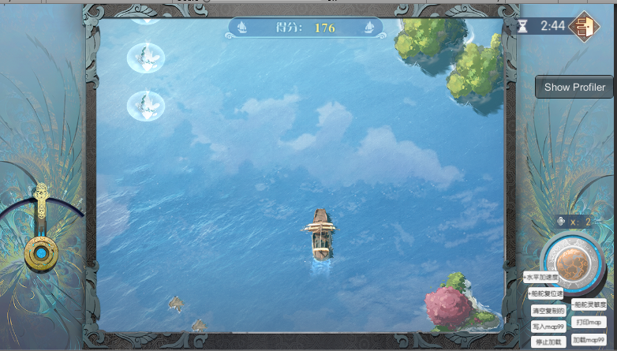

# 航海小游戏

## **地图如何动态生成**

UI的地图分两部分，海面有两片上下交替移动；障碍物、敌人、奖励、炮弹等元素由配置决定生成位置

## **船的移动公式**

设置速度：self.*rb:AddForce(self.* acceleration, 0, 0)

设置方向：GameUtils.setLocalRotation(self.\_goPlayer, 0, 0, -angle)

移动两张背景图

GameUtils.setLocalPos(self.\_imgBg1.gameObject, pos1.x, y1, 0)

GameUtils.setLocalPos(self.\_imgBg2.gameObject, pos2.x, y2, 0)

## **遥感的交互控制**

UIDragTrigger，控制角度，

同时用角度换算船加速度

acc/acceleMulti = angle / maxDragDegree

设置船上rigidbody

## **碰撞**

实体类上获取go的SphereCollider碰撞盒

MonoBehaviour.OnTriggerEnter(Collider)
