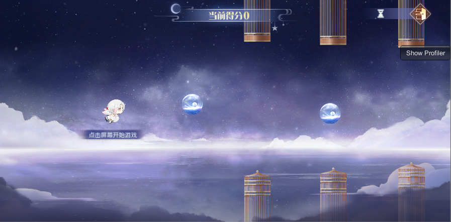
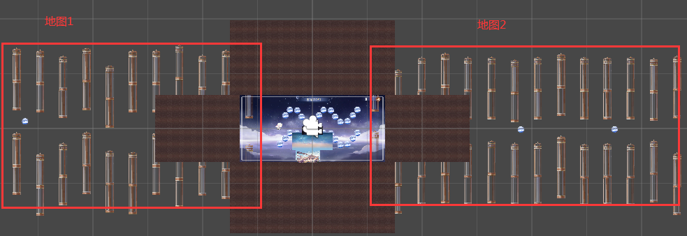

# 飞越九天小游戏



### 碰撞检测实现

1.  在角色形状轮廓取关键检测点，不用碰撞盒和刚体组件，利用2D碰撞检测算法实现

2.  障碍物看作五边形，奖励看作圆形，把物体简化成点与图形的碰撞。

3.  点与多边形碰撞检测方法：从目标点发出一条射线，射线与多边形边的交点个数为奇点说明在内部，偶数则在外部。

```lua
--原理：从目标点出发引一条射线，看这条射线和多边形所有边的交点数目。如果有奇数个交点，则说明在内部，如果有偶数个交点，则说明在外部
--判断点是否在多边形内
--n个多边形上的顶点，pt需要判断的点
function GameUtils.isInPolygon(ptlist,pt)
    local cross = 0
    local count = #ptlist
    for i = 2,count do
        local pt1 = ptlist[i-1]
        local pt2 = ptlist[i]
        if pt1.y ~= pt2.y and pt.y >= Mathf.Min(pt1.y,pt2.y) and pt.y < Mathf.Max(pt1.y,pt2.y) then
            --从P发射一条水平射线 求交点的 X 坐标 原理: ((pt2.y-pt1.y)/(pt2.x-pt1.x))=((y-pt1.y)/(x-pt1.x))
            local x = (pt.y-pt1.y)*(pt2.x - pt1.x) / (pt2.y - pt1.y) + pt1.x
            if x > pt.x then
                cross = cross + 1
            end
        end
    end
    --单边交点为基数，则点在多边形之内
    return cross % 2 == 1
end
```

4\. 利用碰撞优化的粗略阶段思路优化碰撞检测，判断障碍和奖励在角色前后中三个方位，把中方位看作碰撞检测区域，计算碰撞检测。



### 地图加载实现

1.  地图分割成多张地图，配置到表

2.  地图移动的时候（每帧）判断右边距离屏幕中心点距离，达到某个距离下载下一张地图

3.  地图加载后确定出生点，设置相对父节点的位置GameUtils.getRelativeUIPosByWorldPos(beforeWorldPos, self.\_goMapRoot.transform)

4.  地图离开屏幕隐藏

## 游戏玩法实现

1.  角色初始位置不变，做初始速度向上，加速度向下的匀加速度运动，有最大下降速度限制，只改变Y方向上的位移

2.  地图匀速在X轴方向移动

> 衍生知识点：UpdateBeat：ToLua框架提供的方便lua代码做逻辑刷新，方法定义在event.lua中
