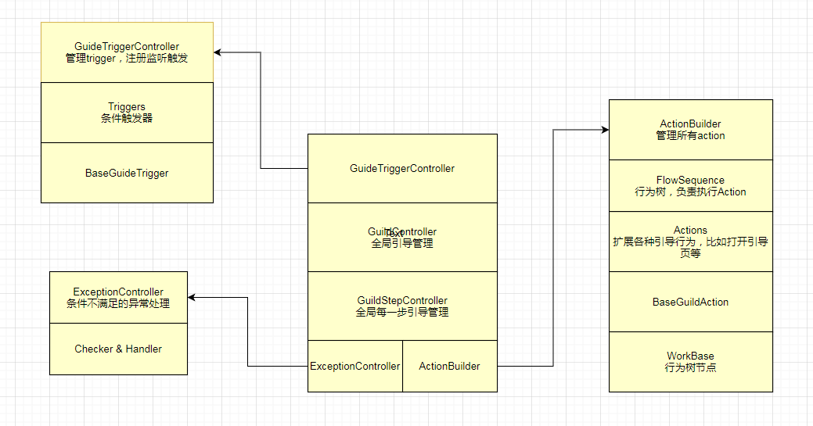

## 目录

*   [新手引导系统](#新手引导系统)

    *   [需求分析](#需求分析)

    *   [系统设计架构](#系统设计架构)

    *   [新手指引遮罩](#新手指引遮罩)

    *   [行为树](#行为树)

# 新手引导系统

## 需求分析

1.  强制引导。必须要完成的，常见是进入游戏新手副本。

2.  条件触发引导。由各种条件达成触发，如达到等级，通关副本等。

3.  中断后再次执行。玩家因异常或主动退出中断引导，根据关键步是否完成情况决定是否再次打开。

4.  异常处理。当条件不满足时执行具体的处理方法。比如提交物品，不存在对应物品，引导直接结束。

5.  附加协议。用于某些关键步，确定收发了指定协议然后确定步骤是否完成。比如引导召唤就判断召唤协议是否返回。

6.  并行。引导动作是否并行执行，比如战斗引导中，英雄挂了，并行执行救援引导。

## 系统设计架构



## 新手指引遮罩

挖空矩形遮罩上的目标显示区域实现

1.  编写继承Graphic的脚本类，绑定在mask view上

2.  根据指定的节点，计算中心点，宽高等数据，确定挖孔区域

3.  在OnPopulateMesh回调中重绘顶点数据，绘制四个矩形组成的一个中间空的图形，这个就是所谓的挖孔实现

4.  脚本类集成IPointerClickHandler接口，在OnPointerClick回调中根据鼠标点位置，判断是否点击在挖孔区域内，接着执行lua点击回调，同时传递点击事件

```lua
ExecuteEvents.Execute(arrow.gameObject, ed, ExecuteEvents.pointerClickHandler);
```

## 行为树

利用行为树控制整个流程，一个引导执行完毕后接着执行另一个引导。

1.  action的执行有行为树FlowSequence类控制，action作为它的children节点，控制其串行执行

2.  每个节点有状态和结果两个属性，onStart()开始执行，执行完成调用onDone()，通知父节点执行next child的onStart()
