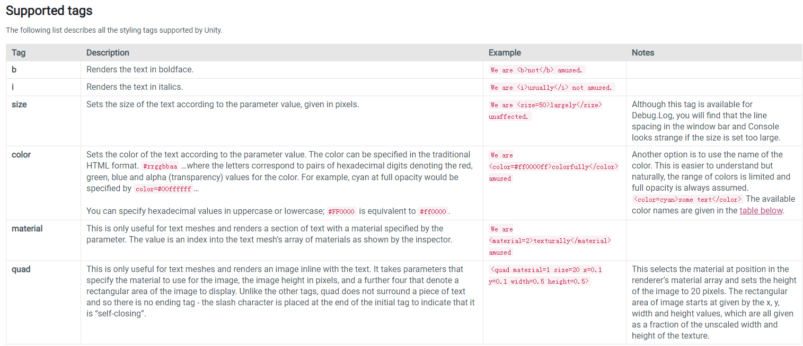

## 目录

*   [UGUI Text组件实现图文混排](#ugui-text组件实现图文混排)

    *   [实现图文混排原理](#实现图文混排原理)

        *   [quad标签的使用](#quad标签的使用)

    *   [渲染内嵌图片](#渲染内嵌图片)

        *   [文字渲染原理](#文字渲染原理)

        *   [流程讲解](#流程讲解)

        *   [代码实现](#代码实现)

    *   [超链接实现](#超链接实现)

        *   [超链接处理流程](#超链接处理流程)

        *   [响应点击事件](#响应点击事件)

# UGUI Text组件实现图文混排

## 实现图文混排原理

Unity手册上介绍UI系统和传统的GUI系统都支持[富文本](https://docs.unity3d.com/2017.4/Documentation/Manual/StyledText.html "富文本")，Text、GUIStyle、GUIText和TextMesh类上有rich text的设置选项，开启它后Unity会解析文本中标记标签。


unity中支持的文本标签如下：



其中quad标签可以渲染出行内内嵌的图片，但是只是对TextMesh组件有效。

> This is only useful for text meshes and renders an image inline with the text.

TextMesh是用来生成3D图形字体，不能直接用在UI Canvas下。

> Text Meshes can be used for rendering road signs, graffiti etc. The Text Mesh places text in the 3D scene. To make generic 2D text for GUIs, use a [GUI Text](class-GUIText.html "GUI Text") component instead.

2D文本渲染需要用GUI Text组件，它属于传统GUI系统，UI系统（即UGUI）下的Text组件也是一样的用途，正如本节开头说到他们都有rich text的设置。

但是UI的文本组件并不支持内嵌的图片，使用quad标签会出现乱码。好在UGUI开源，可以通过重写Text组件以支持渲染内嵌图片的效果。

### quad标签的使用

> \<quad material=1 size=20 x=0.1 y=0.1 width=0.5 height=0.5>

material：渲染组件上引用的材质，值为材质数组的下表，从0开始。

size：决定内嵌图片的像素大小。

x/y/width/height：决定材质贴图上渲染矩形区域的偏移和大小，它们的value代表百分比，类似于uv坐标。

经过测试得知，实际渲染图片大小的关系：图片像素大小 = size \*（width/height）。

可以参考这篇[文章](https://blog.csdn.net/tom_221x/article/details/113456808 "文章")来推测。

使用在UI Text组件上会出现乱码，其实乱码是字体贴图，放大后可以看见贴图上的文字，只不过缩放太小所以看不到。


打开rich text设置才会解析标签，否则不解析：


## 渲染内嵌图片

虽然quad在UI上渲染不出图片，但是可以定义渲染区域大小，可以作为占位符。

借助这个特效，渲染内嵌图片可以分三步：

1.  使用quad标签占位

2.  去除乱码

3.  使用MaskableGraphic类渲染贴图，放置于占位符位置上

项目规定，在渲染贴图之前，需要将所有用到的贴图打到一个spriteAsset上，并且将它引用到UIGraphicTextSprite组件上，UIGraphicTextSprite组件继承MaskableGraphic类，具体使用过程参考这篇[文章](http://wiki.info/pages/viewpage.action?pageId=13736289 "文章")。

### 文字渲染原理


1.左边文本会生成100个顶点数据，100来自假设，但顶点数肯定是4的倍数

2.前8个顶点代表两个中文的位置

3.后面的顶点都是quad标签的顶点，但是unity会做处理，只有前4个代表quad标签的区域，后面顶点位置都位于一个点上，不会渲染内容

### 流程讲解

UGUI Text组件渲染文字代码流程图：


重写渲染流程：


重写渲染流程详细介绍：


### 代码实现

正则表达式匹配quad标签

```c#
private static readonly Regex m_spriteTagRegex =
          new Regex(@"<quad name=(.+?) size=(\d*\.?\d+%?) width=(\d*\.?\d+%?) des=(.+?) />", RegexOptions.Singleline);

foreach (Match match in m_spriteTagRegex.Matches(m_OutputText))
{
  ...
}
```

清除乱码

```c#
//清楚乱码
for (int i = 0; i < listTagInfor.Count; i++)
{
    //UGUIText不支持<quad/>标签，表现为乱码，我这里将他的uv全设置为0,清除乱码
    for (int m = listTagInfor[i].index * 4; m < listTagInfor[i].index * 4 + 4; m++)
    {
        //超出可视范围的不会绘制，即leftBottomIndex >= verts.Count。
        //所以这里不需要处理也不应该处理。若处理，则数组越界。
        if (m >= verts.Count)
        {
            break;
        }
        UIVertex tempVertex = verts[m];
        tempVertex.uv0 = Vector2.zero;
        verts[m] = tempVertex;
    }
}
```

生成网格数据

```c#
  public struct InlineSpriteInfor
    {
        // 文字的最后的位置
        public Vector3 textpos;
        // 4 顶点 
        public Vector3[] vertices;
        //4 uv
        public Vector2[] uv;
        //6 三角顶点顺序
        public int[] triangles;
        public bool isEmptySprite;
        public Texture texture;
        public string name;
    }
    void CalcQuadTag(IList<UIVertex> verts)
    {
        m_AnimSpriteInfo = new Dictionary<int, InlineSpriteInfor[]>();

        //通过标签信息来设置需要绘制的图片的信息
        listSprite = new List<InlineSpriteInfor>();
        for (int i = 0; i < listTagInfor.Count; i++)
        {                                                                         3    2
            var leftBottomIndex = ((listTagInfor[i].index + 1) * 4) - 1;
            if (leftBottomIndex >= verts.Count)
            {
                break;
            }
            InlineSpriteInfor tempSprite = new InlineSpriteInfor();
            tempSprite.name = listTagInfor[i].name;
            tempSprite.isEmptySprite = listTagInfor[i].isEmptySprite;
            
            tempSprite.textpos = verts[leftBottomIndex].position;
            //设置图片的位置
            tempSprite.vertices = new Vector3[4];
            tempSprite.vertices[0] = new Vector3(0, 0, 0) + tempSprite.textpos;
            tempSprite.vertices[1] = new Vector3(listTagInfor[i].size.x, listTagInfor[i].size.y, 0) + tempSprite.textpos;
            tempSprite.vertices[2] = new Vector3(listTagInfor[i].size.x, 0, 0) + tempSprite.textpos;
            tempSprite.vertices[3] = new Vector3(0, listTagInfor[i].size.y, 0) + tempSprite.textpos;

            //计算其uv
            Sprite sprite;
            m_nameToSpriteDict.TryGetValue(listTagInfor[i].name, out sprite);
            Rect spriteRect = sprite.textureRect;
            Texture texSource = sprite.texture;
            tempSprite.texture = texSource;
            Vector2 texSize = new Vector2(texSource.width, texSource.height);
            tempSprite.uv = new Vector2[4];
            tempSprite.uv[0] = new Vector2(spriteRect.x / texSize.x, spriteRect.y / texSize.y);
            tempSprite.uv[1] = new Vector2((spriteRect.x + spriteRect.width) / texSize.x, (spriteRect.y + spriteRect.height) / texSize.y);
            tempSprite.uv[2] = new Vector2((spriteRect.x + spriteRect.width) / texSize.x, spriteRect.y / texSize.y);
            tempSprite.uv[3] = new Vector2(spriteRect.x / texSize.x, (spriteRect.y + spriteRect.height) / texSize.y);

            //声明三角顶点所需要的数组
            tempSprite.triangles = new int[6];
            listSprite.Add(tempSprite);
         }
```

渲染贴图

```c#
void DrawSprite(UIGraphicTextSprites spriteGraphic, List<InlineSpriteInfor> listInlineSprite)
{
  var spriteCanvasRenderer = spriteGraphic.GetComponentInChildren<CanvasRenderer>();
  if (m_spriteMesh == null)
  {
    m_spriteMesh = new Mesh();
  }

  if (drawSpriteVertices == null) drawSpriteVertices = new List<Vector3>();
  else drawSpriteVertices.Clear();
  if (drawSpriteUv == null) drawSpriteUv = new List<Vector2>();
  else drawSpriteUv.Clear();
  if (drawSpriteTriangles == null) drawSpriteTriangles = new List<int>();
  else drawSpriteTriangles.Clear();

  for (int i = 0; i < listInlineSprite.Count; i++)
  {
      var inlineSprite = listInlineSprite[i];
      if (inlineSprite.isEmptySprite) 
      {
          continue;
      }
      for (int j = 0; j < inlineSprite.vertices.Length; j++)
      {
          drawSpriteVertices.Add(inlineSprite.vertices[j]);
      }
      for (int j = 0; j < inlineSprite.uv.Length; j++)
      {
          drawSpriteUv.Add(inlineSprite.uv[j]);
      }
      for (int j = 0; j < inlineSprite.triangles.Length; j++)
      {
          drawSpriteTriangles.Add(inlineSprite.triangles[j]);
      }
  }
  //计算顶点绘制顺序
  for (int i = 0; i < drawSpriteTriangles.Count; i++)
  {
      if (i % 6 == 0)
      {
          int num = i / 6;
          drawSpriteTriangles[i] = 0 + 4 * num;
          drawSpriteTriangles[i + 1] = 1 + 4 * num;
          drawSpriteTriangles[i + 2] = 2 + 4 * num;

          drawSpriteTriangles[i + 3] = 1 + 4 * num;
          drawSpriteTriangles[i + 4] = 0 + 4 * num;
          drawSpriteTriangles[i + 5] = 3 + 4 * num;
      }
  }
  m_spriteMesh.vertices = drawSpriteVertices.ToArray ();
  m_spriteMesh.uv = drawSpriteUv.ToArray ();
  m_spriteMesh.triangles = drawSpriteTriangles.ToArray ();
  
  spriteCanvasRenderer.SetMesh(m_spriteMesh);
  spriteGraphic.UpdateMaterial();
}
```

动态图片是按一定频率切换主贴图和网格数据实现的

```c#
float fTime = 0.0f;
//int iIndex = 0;
void Update()
{
if(listSprite == null || listSprite.Count==0 || m_hasAnimTag==false) return;

fTime += Time.deltaTime;
if (fTime >= DynamicTagSwitchInterval)
{
        UpdateAnimSprite();
  fTime = 0.0f;
}

}

void UpdateAnimSprite() {
    for (int i = 0; i < m_AnimIndex.Count; i++)
    {
        var animIndex = m_AnimIndex[i];
        if (!m_AnimSpriteInfo.ContainsKey(animIndex)) continue;

        m_AnimSpriteStep[animIndex]++;
        if (m_AnimSpriteStep[animIndex] >= m_AnimSpriteInfo[animIndex].Length)
        {
            m_AnimSpriteStep[animIndex] = 0;
        }
        var step = m_AnimSpriteStep[animIndex];
        var inlineSprite = m_AnimSpriteInfo[animIndex][step];
        Sprite sprite;
        m_nameToSpriteDict.TryGetValue(inlineSprite.name, out sprite);
        var spriteGraphic = m_spriteGraphicArray[animIndex];
        spriteGraphic.SetMainTexture(sprite.texture);
        DrawSprite(spriteGraphic, new List<InlineSpriteInfor>(){inlineSprite});
    }

}
```

## 超链接实现

### 超链接处理流程


### 响应点击事件

1.  UIGraphicText组件继承IPointerClickHandler接口，实现OnPointerClick方法

2.  RectTransformUtility.ScreenPointToLocalPointInRectangle方法将屏幕坐标转成local坐标

3.  判断是否点击在包围盒上，从而响应预先绑定的点击事件

源代码

[UIGraphicText.cs](file/UIGraphicText__lKh67xRzm.cs)

[UIGraphicTextSpritesMgr.cs](file/UIGraphicTextSpritesMgr_VeAnnPQruV.cs)

[EmojiSpriteAsset.cs](file/EmojiSpriteAsset_m_7Wcnb4Es.cs)

[UIGraphicTextSprites.cs](file/UIGraphicTextSprites_SJ0ts213El.cs)
