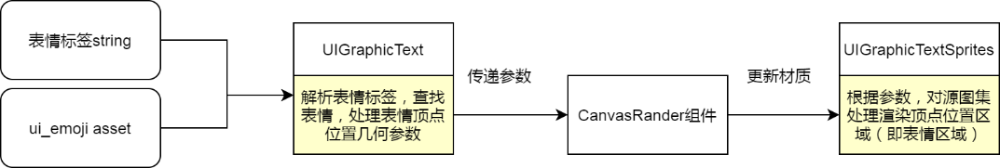
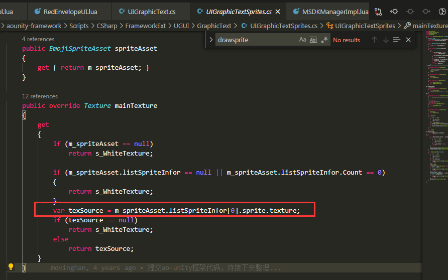
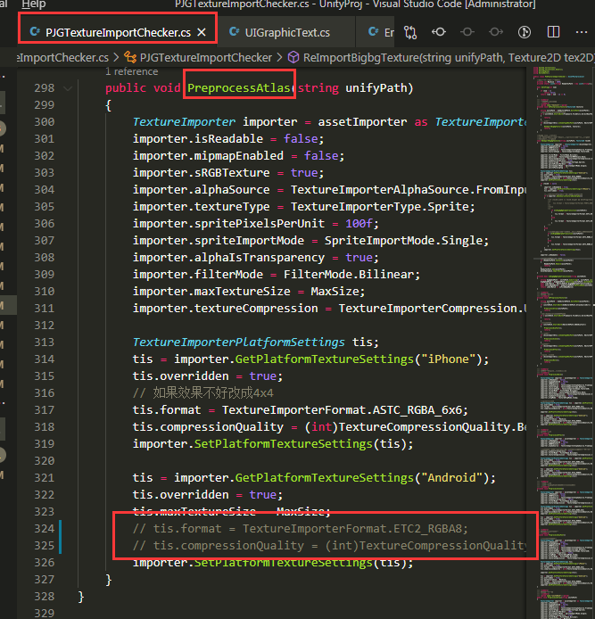
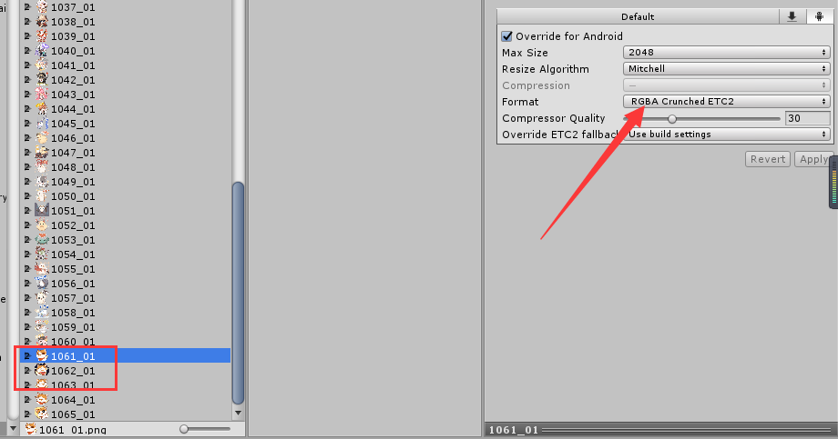
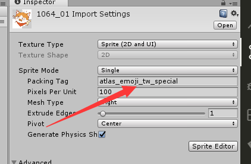
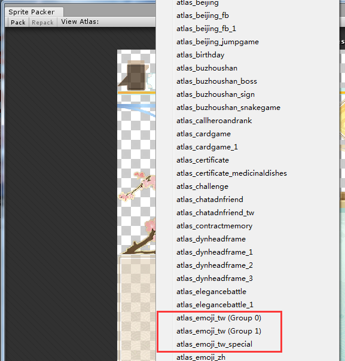
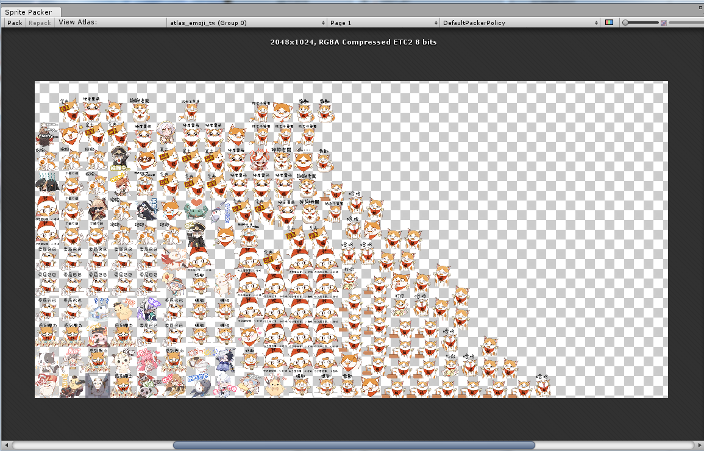
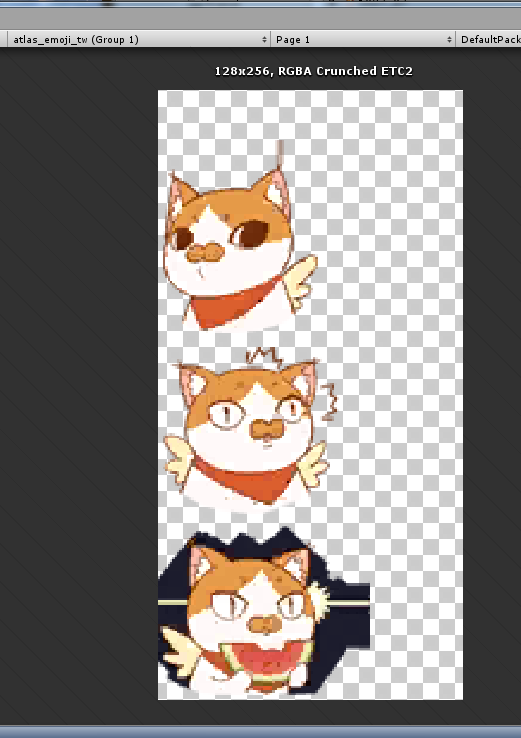
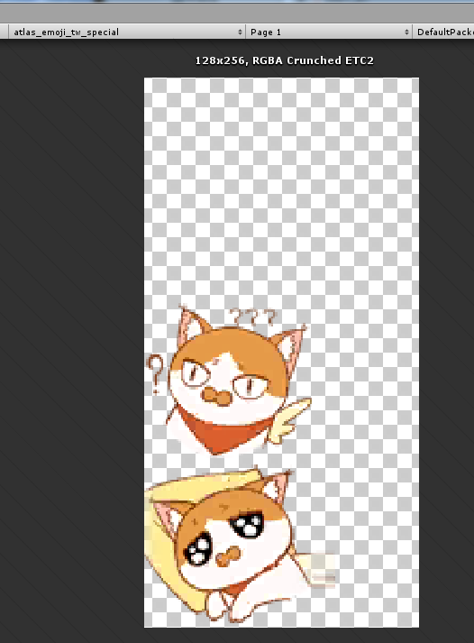

# UIGraphicText表情渲染优化-支持表情来自不同图集

## 背景

当表情sprite没有被打到一个图集上，UIGraphicText类渲染表情或会错乱。

## 表情的渲染过程

聊天窗口表情的渲染过程大致如何：

-   ui_emoji.asset包含所有emoji sprite信息，包括name、引用等。
-   UIGraphicText主要是解析输入内容字符串，得出sprite的顶点几何参数等。
-   CanvasRender应是负责渲染的。
-   UIGraphicTextSprites继承自[MaskableGraphic](https://docs.unity.cn/cn/current/ScriptReference/UI.MaskableGraphic.html)类，这个类的作用是管理源图集，截取源图集的某个区域。

获取源图集的代码：

表情的源图集引用被写死，默认第一个表情的源图集。这就是当表情来自其他图集时，显示错误的原因。

## 优化

目前所有的表情会打到一个图集上，下面两种场景会导致表情打到不同图集：

1.  表情增加，直到2048\*2048大小装不下（图集maxsize为2048是项目组限制，因为在一些低端机上加载不了大于2048的图）
2.  表情sprite的tag不一致，需要用别的tag划分表情（tag决定sprite所属的图集）

为了满足以上两种场景，需要对这个系统进行优化，支持表情来自不同的图集。

有两个步骤：

1.  更改mainTexture获取

展开源码

// UIGraphicTextSprites.cs

public class UIGraphicTextSprites : MaskableGraphic

{

...

private Texture \_texSource; // 由外部传入改写mainTexture

public override Texture mainTexture

{

get

{

if (m_spriteAsset == null)

return s_WhiteTexture;

if (m_spriteAsset.listSpriteInfor == null \|\| m_spriteAsset.listSpriteInfor.Count == 0)

{

return s_WhiteTexture;

}

if (_texSource != null)

{

return \_texSource;

}

var texSource = m_spriteAsset.listSpriteInfor[0].sprite.texture;

if (texSource == null)

return s_WhiteTexture;

else

return texSource;

}

}

public void SetMainTexture(Texture t)

{

\_texSource = t;

}

...

}

2\. 更改对应的源图集

展开源码

// UIGraphicText.cs

void CalcQuadTag(IList\<UIVertex\> verts)

{

...

Texture texSource = listSpriteInfor[0].sprite.texture;

for (int j = 0; j \< listSpriteInfor.Count; j++)

{

//通过标签的名称去索引spriteAsset里所对应的sprite的名称

if (listTagInfor[i].name == listSpriteInfor[j].name) {

spriteRect = listSpriteInfor[j].sprite.textureRect;

texSource = listSpriteInfor[j].sprite.texture;

m_spriteGraphic.SetMainTexture(texSource);

break;

}

}

// Texture texSource = listSpriteInfor[0].sprite.texture;

...

}

这里是patch文件，可以直接取用。由于只有UIGraphicTextSprites.cs位于子库中，所以会有两个patch。

[0001-feat-sprite.patch](/download/attachments/71079962/0001-feat-sprite.patch?version=1&modificationDate=1620469376000&api=v2)

[0001-submodule-feat-sprite.patch](/download/attachments/71079962/0001-submodule-feat-sprite.patch?version=1&modificationDate=1620469377000&api=v2)

### 0714更新

发现动态表情在pc上不打图集情况下显示有问题，表情并没有想预期一样动，有的甚至不动。

动态表情的实现原理是按一定的帧率改变sprite的顶点、uv和网格三角形参数，通过CanvasRenderer组件和UIGraphicTextSprites组件（继承MaskableGraphic），截取源图texture（sprite或者图集）得到显示区域。

原因是不打图集时，动态表情的源图获取不正确，截取的源图永远是第一张。

解决方法是在Update()中切换sprite截取参数同时改变UIGraphicTextSprites的mainTexture。

更改commit看这里。

## 检验

我的unity目标平台是android，先将textureImporter对安卓图片压缩格式更改代码注释掉，否则更改压缩格式会被重置。

更改1601_1,1602_1,1603_1的format为区别于ETC2_RGBA8的其他格式，测试不同压缩格式打包不同图集的场景：

更改1604_1,1605_1的tag，测试不同tag打包到不同图集的场景：

sprite packer上pack图集，检查表情的确打到了三个不同的图集：

  

pc上测试，正常。

安卓上测试，正常。
