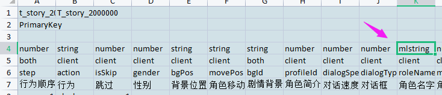
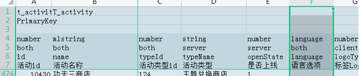
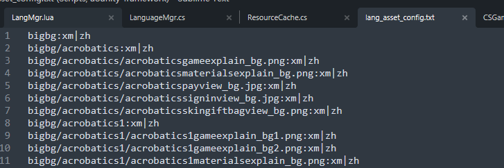

# 多语言系统设计

多语言系统包括：

*   配置表多语言方案

*   lua代码多语言替换

*   资源多语言加载

*   SDK多语言隔离

## 配置表多语言方案

1.  配置表类型mlstring，代表多语言的string类型，显示在游戏中的文字，会根据当前语言版本从language表获取。



```lua
-- 导表工具导出的t_const.lua
local title = { id=1, value=2, value2=3 }
local dataList = {...}
local t_const = {
  [1] = dataList[1],
  ...
}

local mt = {
  __index = function (t, key)
    local index = title[key]
    if index then
      local value = rawget(t, index)
      if multiLanguageCells[key] then
        value = lang(value)
      end
    end
  end
}

--根据id获取多语言表中的文本,id为多语言表中的id
function lang(id)
  if GameUtils.isEmptyString(id) then
    return ""
  end
  local languageCO = nil
  for i, languageConfigName in ipairs(self:_getLanguageConfigNames()) do
    languageCO = self[languageConfigName][id]
    if languageCO then
      break
    end
  end
  if not languageCO then
    return id
  end
  local langContent = languageCO["content" .. self:getLangType()]
  if GameUtils.isEmptyString(langContent) then
    return languageCO["content" .. kDefaultLangType]
  else
    return langContent
  end
  return id
end


```

2\. 配置表类型language，实现过滤功能。导表工具会过滤掉非当前语言版本的项。



## lua代码多语言替换

利用动态脚本语言的重写特性，实现逻辑的重写。利用sdk类型区分代码替换模块。

```lua
// 热更之后
function LogicLauncher:onManifestLoad()
  InternationalLogicMgr.replaceLogic()
end

function InternationalLogicMgr.replaceLogic()
  local sdkType = BootstrapHelper.getSDKType()
  if sdkType == BootstrapHelper.SDK_TYPE_EFUN then
        TWLogicReplace.doReplace()
    end
end

function TWLogicReplace.doReplace()
  TWMainViewPresentor.replace()
  ...
end

function TWMainViewPresentor.replace()
  TWMainViewPresentor._buildUI = MainViewPresentor.buildUI
  MainViewPresentor.buildUI = function (self)
    TWMainViewPresentor._buildUI(self)
    ...
  end
end
```

## 资源多语言加载

多语言资源按目录来区分，放在和GameAssets有一样目录结构的language文件夹下。

用一份多语言资源清单记录区分了多语言的资源列表：



资源加载时会从这个表查找，优先加载多语言目录下的资源。

```lua
function loadRes(path)
  local currLang = getCurrLang();
  local langs = Asset_Lang_Table[path];
  local realPath = path;
  if table.indexOf(langs, currLang) then
    realPath = "language/"..currLang.."/"..path;
   end
   return realPath;
end
```

## SDK多语言隔离

新增一个海外版本，需要拷贝业支提供的模板工程

安卓

安卓工程根据settings.gradle文件将需要海外版本gradle文件包含进来，实现隔离。

每个海外版都有自己的gradle文件，会和common build.gradle文件混淆使用。

IOS

IOS包是基于target来构建的，需在xcode上新建一个target，然后填上scheme配置、添加证书等。

Podfile文件需要添加对应target，根据target导入相应的三方包。

lua层

通过调用C# native方法来获取当前使用的sdk类型，来实现lua层sdk区分

```lua
local manifestWrapClazz = "com.baitian.unity.ManifestUtilWrap"
function SDKManager.getSDKType()
    local param = {}
    param.key = "sdkType"
    local result = NativeBridge.instance:invokeInt(manifestWrapClazz, "getIntMetaData", param)
    return result
end
```

C#利用宏实现native sdk代码调用

```lua
using System.Runtime.InteropServices;
using UnityEngine;

public class NativeMgr : SingletonMonoBehaviour<NativeMgr>
{
  #if UNITY_IOS && !UNIRT_EDITOR
    [DllImport ("__Internal")]  
    private static extern void   invokeNative(string clazz, string method, string param);
  #endif
  
  public void CallStatic(string clazz, string method, string param)
  {
      #if UNITY_EDITOR
          CLogger.Log(String.Format("NativeMgr CallStatic by Editor -> [clazz]:{0}, [method]:{1}, [param]:{2}",
              clazz, method, param));
      #elif UNITY_ANDROID
          AndroidJavaClass javaClazz = new AndroidJavaClass(clazz);
          javaClazz.CallStatic(method, param);
      #elif UNITY_IOS
          invokeNative(clazz, method, param);
      #endif
  }
}
```
