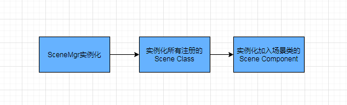
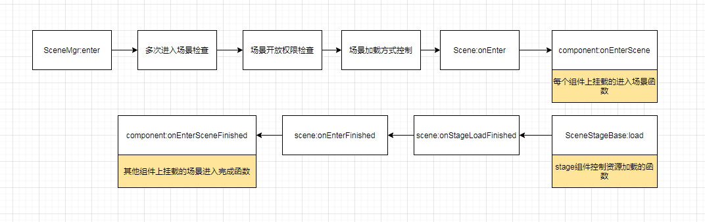
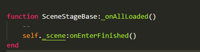
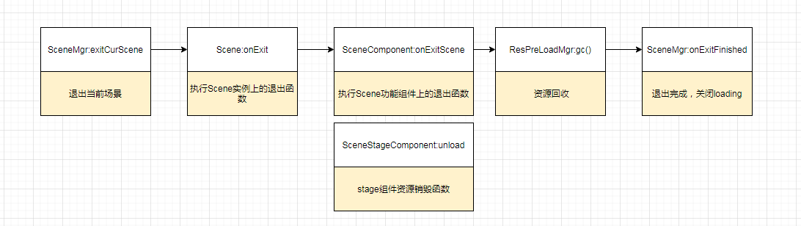

# 场景控制流程解读\[new]

## 1 初始化流程

场景的初始化和进出控制有SceneMgr类负责管理，SceneMgr类实例化的时候，会对所有的场景类做一系列的初始化操作，包括场景类实例化，加入场景类中的功能组件类的实例化。

1.  实例化所有注册到SceneMgr:\_registerScenes()中的场景类，然后在每个场景中注入onEnterFinished和onStageLoadFinished函数，分别在进入完成和舞台加载完成时调用，控制loading页面的关闭和资源的释放

2.  在实例化Scene Component时，执行自身的onInit函数，进行初始化的工作。

以上就是场景实例化的流程。

加入新的场景代码需要以下：

1.  在SceneType文件加入场景type

2.  在Editor的pjg>场景编辑器>场景导出，新增场景id和资源配置，保存导出生成t\_scene配置

3.  新增场景类代码，并加入stage组件，控制场景资源的加载。

4.  在SceneMgr:\_registerScenes()注册场景类

## 2 进入流程

1.  stage组件类中需要加入load函数，控制场景资源的加载，并且在资源加载完成回调中调用调用\_onStageLoadFinished函数和\_onAllLoaded函数

2.  调用\_onStageLoadFinished函数需在\_onAllLoaded函数之前，\_onAllLoaded函数其实就是调用了scene:onEnterFinished函数&#x20;

1.  场景资源其实是prefeb资源，实例化后被挂载在【SCENEROOT/场景名]】节点下

## 3 退出流程

## 4 场景组件的类型和作用

|                      |                                                                          |                                                     |    |
| -------------------- | ------------------------------------------------------------------------ | --------------------------------------------------- | -- |
| 类型                   | 用途                                                                       | 相关配置表                                               | 其他 |
| SceneStageBase类      | 控制场景资源（舞台）加载和释放，注入的onEnterFinished和onStageLoadFinished函数在这个类中调用          | t\_scene（在Editor上【pjg>场景编辑器>场景导出】生成）                |    |
| SceneCameraBase类     | 负责相机的参数设置和相机的焦点跟随，相机的参数配置在camera表                                        | t\_camera                                           |    |
| SceneZoneMgr类        | 负责管理场景上所有的区域，场景分区域加载是管理大资源加载的一种手段。一般简单的场景不需要加，主场景和主线副本场景比较大会分区域，需要用到这个类。 | t\_scene，t\_scene\_zone（在Editor【pjg>场景编辑器>区域导出】上生成） |    |
| SceneCfgFinder类      | 负责管理场景配置信息的查找，场景配置查找的代码可以写进这个类的衍生类。                                      |                                                     |    |
| SceneGlobalTouchMgr类 | 负责识别和管理场景上的屏幕触摸事件，包括点击、缩放、和拖拽。最大允许两点触摸，小屋的放大缩小就是通过这个类实现的                 |                                                     |    |
| TriggerFactory类      | 场景触发器，通过id初始化触发器并派发触发器根据条件触发动作。比如场景中的预制和特效加载完成触发一些动作                     | t\_scene\_trigger，t\_scene\_triggeraction           |    |
| UnitFactoryBase类     | 管理场景里面的各个单元，比如主界面的陆吾猫的实现就可以当做一个单元                                        |                                                     |    |
| UnitBase类            | 子类作为单元各个功能组件的容器，单元类各功能的实现需要封装进UnitComponentBase类的之类                      |                                                     |    |
| UnitComponentBase类   | 单元功能组件的封装                                                                |                                                     |    |
