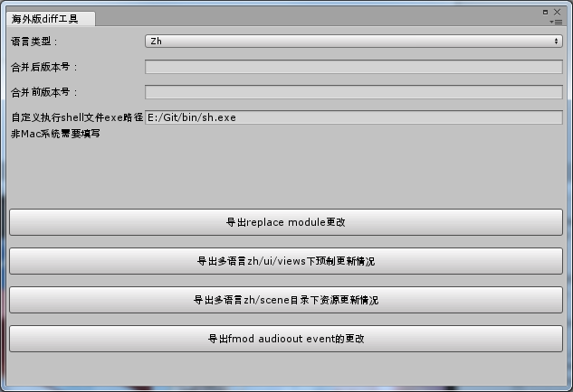
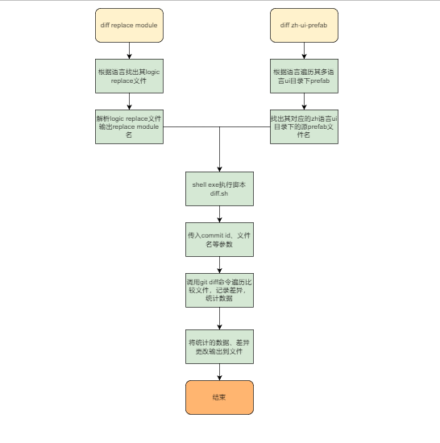

## 目录

*   [海外版本diff工具使用指引](#海外版本diff工具使用指引)

    *   [一、背景](#一背景)

    *   [二、使用介绍](#二使用介绍)

    *   [三、实现思路](#三实现思路)

    *   [四、sh脚本语法](#四sh脚本语法)

# 海外版本diff工具使用指引

## 一、背景

海外版本是从国内版本基础上做差异化替换而来，代码上采用replaceModule的方式覆盖重写module的方法，资源上优先加载对应语言目录下的替换资源。

这种方案决定了，大多数替换内容（代码、预制物等） 是在源内容的基础上演变而来，依赖源内容。当合并国内版本后，需要检查源内容做了什么哪些修改，代码上有没有逻辑冲突，预制资源方面需不需要更新。

可以总结有两个需求：

1.  检查replace的module在合并前后代码有哪些更新

2.  检查出替换的预制在合并前后有哪些是更新了

更新：

追加了其他两个需求：

1.检查多语言的scene目录资源在合并前后的更改和新增情况

2.检查fmod资源的更新情况

## 二、使用介绍

选项介绍：

*   语言类型：选择当前语言类型，必填。

*   合并后版本号：海外dev分支合并国服版本后的commitID，commitID太长不一定需要填全部，git能够识别commit即可，必填。

*   合并前版本号：海外的dev分支合并国服版本前的commitID，必填。

*   自定义执行shell文件的exe路径：用于执行diff.sh脚本的shell exe路径。假如你的系统有git-bash.exe，填它的路径也可以。windows上必填，因为windows上默认的终端可能是cmd.exe，它执行shell文件会不成功。mac系统可以不填。

比如台湾版本：

语言类型选：tw

合并前后版本到gitlab pjg-client仓库commit栏目上找commitID。

功能介绍：

*   导出replace module更改：将replace module代码文件的差异导出到桌面上，文件名replace-module-{commitID0}-{commitID1}.diff。

*   导出多语言目录zh/ui/views下的预制perfab文件更新情况：将多语言目录下ui的prefab文件对应的zh目录源文件在两个版本间的差异，和zh目录下新增但海外语言目录没有的预制内容导出到桌边，文件名zh-UIPrefab-{commitID0}-{commitID1}.diff。

*   导出多语言目录zh/scene下所有资源的更新情况：同上，多语言目录的资源对应的zh目录下的资源，对比两个版本前后zh目录的资源更新情况和新增情况，然后由场景决定是否需要更新对应多语言（如tw）目录的资源。执行会导出diff文件到桌面。

*   导出fmod event的更改情况：检出更改的文件，决定是否更改对应多语言目录下的文件，参考：[fmod多语言工具使用流程](http://wiki.info/pages/viewpage.action?pageId=88181190 "fmod多语言工具使用流程")。

## 三、实现思路

实现原理很简单，就是找出相应的文件名，调用git diff命令输出差异即可。

## 四、sh脚本语法

工具利用c# API Process类执行sh脚本，diff.sh脚本主要做两件事情，一是解析参数，二是调用git diff命令。

这里简单解析下sh语法，帮助理解代码。

1、获取参数

\$@

2、定义数组

commitIdArr=()

3、数值自增

((commitIdArr\_index++))

4、获取变量值

$moduleNameArr_index或者${outputFileName}

5、输出数组内容

echo moduleNameArr\[@]

6、数组长度

\${#moduleNameArr\[@]}

学习shell脚本语法可以查看这里：[shell教程](https://www.runoob.com/linux/linux-shell.html "shell教程")。

代码：

[LanguageDiffWindow.cs](file/LanguageDiffWindow_xSMzWdHsMs.cs)

[diff.sh](file/diff_7U8prTz5se.sh)
