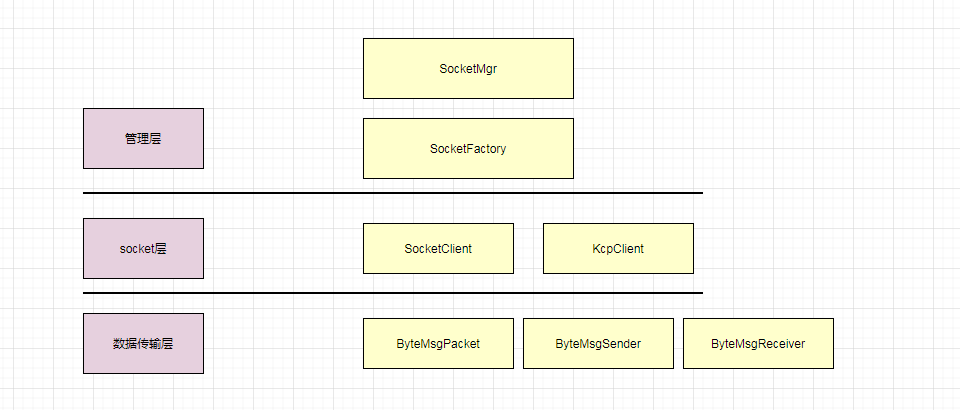
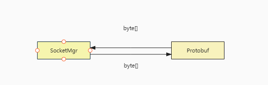
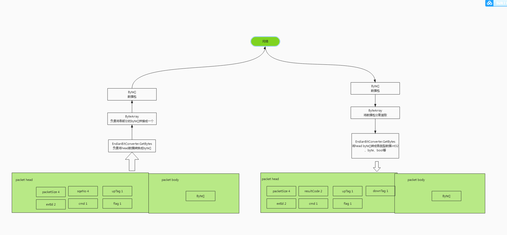
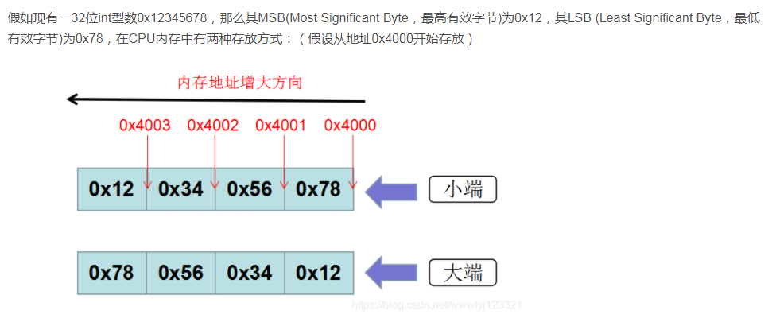

# 网络层

数据传输格式使用protobuf工具协定，tolua集成了protobuf提供使用。

protobuf.lua：构造协议体、赋值、扩展。

数据上行下行序列化过程

大小端

大小端指数据在机器中的字节在内存中的排序方式。[链接](https://blog.csdn.net/wwwlyj123321/article/details/100066463 "链接")

[帧同步\[new\]](https://www.wolai.com/9NnWJY9qynP9M8C2SiVYdW "帧同步\[new]")
