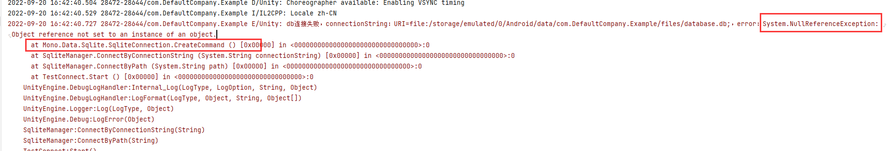

# SQLite替换lua配置表方案实现

## 前言

目前游戏中的配置数据实在启动时一次性全部加载进内存，这种方式会造成一定的浪费。而SQLite是一个轻量级的、动态连接的数据库引擎。

下文探索使用SQLite替换Lua配置表解决内存浪费方案的实现。

## splite库的编译与引入

两个方向：

1.C#层引入sqlite3.dll，写好接口，暴露给lua层调用。

sqlite3.dll引入：[https://cloud.tencent.com/developer/news/314242](https://cloud.tencent.com/developer/news/314242 "https://cloud.tencent.com/developer/news/314242")

2.lua层使用第三方库lsqlite3，将lsqlite3库编译进tolua.dll，在lua层直接链接并操作数据库。

如何将三方库编译进tolua：[https://blog.csdn.net/linxinfa/article/details/90046840。](https://blog.csdn.net/linxinfa/article/details/90046840。 "https://blog.csdn.net/linxinfa/article/details/90046840。")

这个方案代价是需要将各个平台的tolua动态库文件都编译一遍，将lsqlite3库包含进来。

有两个三方库文件可以使用：

1.lsqlite3：动态链接sqlite3（所以需要将sqlite3也编译进tolua）。

2.lsqlite3complete：包含sqlite3在内，静态链接sqlite3（不用再将sqlite3编译进tolua）。

## 测试数据

unity：2020.3.2f

真机：联想 拯救者2 pro/CPU晓龙888/内存8GB/Android 11

### 1.堆内存对比

|            | **首次进入主界面** | **播放剧情** | **过一遍各个系统** |
| ---------- | ----------- | -------- | ----------- |
| lua配置表全加载  | 11.2MB      | 11.54MB  | 16.4MB      |
| sqlite按需加载 | 9.2MB       | 9.45MB   | 15.69MB     |

由于2020unity打的包真机上连不上profiler，所以以上数据在**Editor**用工具测试lua内存。

简单对比，sqlite按需加载配置方案在内存上比全加载lua配置表要**节省内存。** 理由可想而知，不必要的配置不用加载进内存。

### 2.执行时间对比

a.启动方式耗时对比

| **启动时配置的加载方式**      | **Editor-时间(s)** | **Android-时间(s)** |
| ------------------- | ---------------- | ----------------- |
| lua配置表全加载           | 0.035            | 0.030             |
| sqlite连接db，加载所有表并解析 | 2.694            | 1.242             |
| sqlite只链接db，按需加载表   | 0.004            | 0.016             |

对比来看，启动时使用sqlite连接db按需加载表的方式快一点，但是比较是毫秒级别，原来的lua配置表全加载方式也不是很慢。

b.查找时间对比

|        | **查1次** | **查100次** | **查10000次** |
| ------ | ------- | --------- | ----------- |
| lua配置表 | 4.3e-05 | 0.0005    | 0.0025      |
| sqlite | 5.4e-05 | 0.0285    | 2.580       |

配置表一般是只读，不会新增、修改、删除。从查找速度来看，肯定是lua配置表块，字典结构而且直接从内存中读，读取db就相对慢很多。单独看，单独一句查询id的sql执行效率也非常快。

### 3.热更新方式对比

数据量：

*   小量数据：对标周更后的hotfix，一般只会修改一两处配置，修改数据量在个位数。

*   一般数据：对标周更，使用git命令统计食物语周更lua配置文件修改情况，大约会有20个左右文件被修改。

*   大量数据：对标月更，统计得出大约有150个lua配置文件被修改。

假设平均一个文件10行数据被修改，那么周更大约200条修改，月更大约1500条修改，一条修改对应一条sql语句。

对于替换db的热更方式，不管数据量都是整个db替换。

以下是测试数据，多次测量取平均的结果：

| **【时间ms】**            | **小量数据(9)** | **一般数据(200)** | **一般数据(800)** | **大量数据(1500)** |
| --------------------- | ----------- | ------------- | ------------- | -------------- |
| 热更sql （一个sql文件作为一条命令） | 12.9        | 51.2          | 892.3         | 2717           |

以下是热更不同大小db文件的统计情况：

| **db大小**          | **1576kb（1.53MB）** | **33.4MB** | **60.6MB** |
| ----------------- | ------------------ | ---------- | ---------- |
| 压缩后               | 284kb              | 7.58MB     | 15.7MB     |
| 压缩率               | 82%                | 77%        | 74%        |
| 热更耗时ms (解压+替换+连接) | 81.6               | 1000.5     | 1778.7     |


将两种方式放在一起对比，可以直观得出结论：**hotfix、周更比较适合选sql方式，月更选替换db方式**。

**上面sql执行是一次性执行整个sql文件字符串，所以sql命令解析时间比较长。后面优化以行为单位执行sql文件，5000行左右的sql执行效率在0.5s左右，效率比替换30M DB还高。**

## 工作量设计

流程图：


### 1.导表工具改造，cvs表格导入db

a.类型转换

C#方法获取的数值类型在lua中属于userdata，发现的影响是不能直接和string直接拼接，稳妥起见，最好使用tonumber(tostring(userdata))转换为lua的数值类型。

配置表中常见的类型需要对应db的存储类型：

| **配置表中的类型** | **number** | **string\|mlstring** | **float** | **boolean** | **datetime** | [**type**](https://file+.vscode-resource.vscode-cdn.net/c:/Users/laotuzhu/Desktop/\[number]\|\[string] "type") |
| ----------- | ---------- | -------------------- | --------- | ----------- | ------------ | -------------------------------------------------------------------------------------------------------------- |
| 对应的db存储的类型  | int64      | string               | float     | boolean     | string       | string                                                                                                         |

说明：\[type]表示数组类型，元素类型多为number或者string，db中存储为string类型即可，lua中取出来时再解析为table。存为string时候，开头添加标识符`[type]:`，表示需要被解析。

lua中获取各类型转换方式如下：

```lua
local fieldName, value = reader:GetName(i), nil;
local type = reader:GetFieldType(i);
type = tostring(type)
if type == "System.Int64" or type == "System.Int32" or type == "System.Int16" then
    value = tonumber(tostring(reader:get_Item(fieldName)))
elseif type == "System.Float" then
    value = tonumber(tostring(reader:GetFloat(i)))
elseif type == "System.Double" then
    value = tonumber(tostring(reader:GetDouble(i)))
elseif type == "System.Decimal" then
    value = tonumber(tostring(reader:GetDecimal(i)))
elseif type == "System.Boolean" then
    value = tostring(reader:GetBoolean(i))=="true" and true or false
elseif type == "System.String" then
    value = tostring(reader:get_Item(fieldName)
   if "[type]:" == string.sub(value, 1, 7) then
        value = GameUtils.json.decode(string.sub(value, 8))
    end
end
```

b.cvs2db数据解析导入工具

sqlite清空表不支持TRUNCATE TABLE语句，需用DELETE FROM TableName。

sqlite语句和传统的sql语句不太一样，比如不支持多行插入数据，只支持单行插入。

推荐[在线sqlite运行工具](http://sqlite.jsrun.net/ "在线sqlite运行工具")测试语句，或者在[Navicat for SQLite](https://www.navicat.com.cn/download/navicat-for-sqlite "Navicat for SQLite")软件上新建查询执行sql语句。

### 2.config类接口适配

需要在lua层链接数据库，查询表读出数据，然后将数据格式化成相同结构的lua配置表类（t\_xxx.lua），这样就可以低成本适配config类接口。

这里关键点在于处理db数据类型转换lua数据类型，也就是上述的lua中获取各类型转换方式。

```lua
local M = class("SqliteMonoMgr")
 
local TInt64 = "Int64"
local TInt32 = "Int32"
local TInt16 = "Int16"
local TFloat = "Float"
local TDouble = "Double"
local TDecimal = "Decimal"
local TBoolean = "Boolean"
local TString = "String"
local TArrayPrefix = "[type]:"
 
function M:loadConfigTable(tableName)
    local ret,reader = true
 
    xpcall(function ()
        local pks = self:_getPrimaryKeys(tableName)
        reader = self._sqliteManager:SQLSelect(tableName)
        if reader and not reader.IsClosed then
            self._cache[tableName] = self:_readConfigTable(reader, pks)
            self._loadedTable[tableName] = true
            reader:Close()
        else
            ret = false
            printWarn("not such table "..tableName)
        end
    end, function (err)
        ret = false
        if reader then
            reader:Close()
        end
        printError(err)
        -- self:close()
    end)
 
    return ret
     
end
 
function M:_readConfigTable(reader, pks)
    local configTable = {}
    if not reader.HasRows then
        return configTable
    end
     
    local dataList, title = self:_readDataListAndTitle(reader)
    configTable.dataList = dataList
    -- 按索引构造字典
    local pkCount,temp = #pks,nil
    if pkCount>0 then
        for i,v in ipairs(dataList) do
            temp = configTable
            for i=1,pkCount,1 do
                local pk = pks[i]
                local pv = v[pk]
                if i==pkCount then
                    temp[pv] = v
                    break
                end
                if not temp[pv] then
                    temp[pv] = {}
                end
                temp = temp[pv]
            end
        end
         
    end
    return configTable
end
 
function M:_readDataListAndTitle(reader)
    local title = {}
    local dataList = {}
    while reader:Read() do
        local visibleFieldCount, row = reader.VisibleFieldCount, {}
        for i = 0, visibleFieldCount - 1 do
            local fieldName, value = reader:GetName(i), nil;
            title[fieldName] = i+1
            local type = reader:GetFieldType(i);
            type = string.sub(tostring(type), 8)
            if type == TInt64 or type == TInt32 or type == TInt16 then
                value = tonumber(tostring(reader:get_Item(fieldName)))
            elseif type == TFloat then
                value = tonumber(tostring(reader:GetFloat(i)))
            elseif type == TDouble then
                value = tonumber(tostring(reader:GetDouble(i)))
            elseif type == TDecimal then
                value = tonumber(tostring(reader:GetDecimal(i)))
            elseif type == TBoolean then
                value = tostring(reader:GetBoolean(i))=="true" and true or false
            elseif type == TString then
                -- value = reader:GetString(i)
                value = tostring(reader:get_Item(fieldName))
                if TArrayPrefix == string.sub(value, 1, 7) then
                    value = GameUtils.json.decode(string.sub(value, 8))
                end
            end
            table.insert(row, value)
        end
        table.insert(dataList, row)
    end
 
     -- 构造元表
     local mt = {
        __index = function(t, key)
            local index = title[key]
            if index then
                return rawget(t, index)
            end
        end
    }
    for i,v in ipairs(dataList) do
        setmetatable(v, mt)
    end
    return dataList, title
end
 
function M:_getPrimaryKeys(tableName)
    if self._tablePrimaryKeyCache[tableName] then
        return self._tablePrimaryKeyCache[tableName]
    end
    local pks = {}
    local reader = self._sqliteManager:ExecuteReader("PRAGMA table_info("..tableName..")")
    if reader then
        while reader:Read() do
            local isPk = reader:GetBoolean(reader:GetOrdinal("pk"))
            if isPk then
                table.insert(pks, reader:get_Item("name"))
            end
        end
        reader:Close()
    end
    self._tablePrimaryKeyCache[tableName] = pks
    return pks
end
```

### 3.按需加载表

可以利用lua元表，当table索引一个表时再去查询db读取整个表并解析成lua配置表类。

```lua
local configDictMetaTable = {
    __index = function(t, key)
        if not rawget(t, key) then
            print("sqlite 加载表：" .. key)
            local configTable = SqliteMonoMgr.instance:findAll(key)
            rawset(t, key, configTable)
            return configTable
        end
    end
}
 
ConfigMgr.instance.requestConfig = function(self, name, configObj)
    local mt = getmetatable(configObj._dict)
    if mt ~= configDictMetaTable then
        setmetatable(configObj._dict, configDictMetaTable)
    end
    local isExistInDB = SqliteMonoMgr.instance:isExistTable(name)
    if self._configDict[name] then
        local content = self._configDict[name]
        configObj:handleConfig(name, content)
    else
        local content
        if not isExistInDB then
            local path = self._pathPrefix .. name
            content = require(path)
            self._configDict[name] = content
        end
        configObj:handleConfig(name, content)
    end
end
```

框架中lua配置是预加载+全加载的，其实也可以利用元表做到懒加载，当真正用到数据是才加载。

```lua
function genProxyMt(name, path)
    local name = name
    local path = path
    local loaded = false
    local datasource = nil
     
    return function (t, k)
            if not loaded then
                datasource = require(path)
                ConfigMgr.instance:_preProcessConfig(datasource, name)
                loaded = true
            end
            return datasource[k]
        end
end
 
function ConfigMgr:requestConfig(name,configObj)
    local proxy = {}
    local mt_proxy = {
        __index = genProxyMt(name, path)
    }
    setmetatable(proxy, mt_proxy)
    configObj:handleConfig(name, proxy)
end
```

### 4.单独一套sqlite lua查询接口

用于业务查询配置，区别于以往方案的baseConfig类。

```lua
local M = class("SqliteMonoMgr")
 
-- 根据id查询
-- @return 返回主键查询结果，只有一条数据返回数据本身，多条数据返回table（多个主键的情况）
function M:findById(tableName, value, pk)
    if GameUtils.isEmptyString(tableName) then
        printError("tableName is nil.")
        return
    end
    local t = os.clock()
    if pk==nil then
        pk = "id"
    end
    if self._cache[tableName] and self._cache[tableName][value] then
        print("findById 命中缓存耗时："..os.clock()-t, tableName, value, pk)
        return self._cache[tableName][value]
    end
 
    local reader = self._sqliteManager:SQLSelect(tableName, "*", string.format("where %s=%s", pk, value))
    if reader and not reader.IsClosed then
        local dataList = self:_readDataListAndTitle(reader)
        reader:Close()
        if not self._cache[tableName] then
            self._cache[tableName] = {}
        end
        if #dataList==1 then
            self._cache[tableName][value] = dataList[1]
            print("findById 耗时："..os.clock()-t, tableName, value, pk)
            return dataList[1]
        else
            print("findById 耗时："..os.clock()-t, tableName, value, pk)
            self._cache[tableName][value] = dataList
            return dataList
        end
    end
 
end
 
-- 根据条件查询
-- @return 返回table
function M:findAll(tableName, ...)
    local t = os.clock()
    local conditions = {...}
    if #conditions==0 then
        if not self._loadedTable[tableName] then
            self:loadConfigTable(tableName)
        end
        print("findAll 耗时："..os.clock()-t, tableName)
        return self._cache[tableName]
    end
 
    local conditionStr = "where"
    for i=1,#conditions,2 do
        local key = conditions[i]
        local value = conditions[i+1]
        conditionStr = conditionStr..string.format(" %s=%s and", key, value)
    end
    conditionStr = string.sub(conditionStr, 1, -4)
    print("sql conditionStr:", conditionStr)
    local reader = self._sqliteManager:SQLSelect(tableName, "*", conditionStr)
    if reader and not reader.IsClosed then
        local dataList = self:_readDataListAndTitle(reader)
        reader:Close()
        print("findAll 耗时："..os.clock()-t, tableName)
        return dataList
    end
end
 
-- 通过输入sql查询
function M:findAllBySql(sql)
    if string.isEmptyString(sql) then return end
    local t = os.clock()
    local reader = self._sqliteManager:ExecuteReader(sql)
    if reader and not reader.IsClosed then
        local dataList = self:_readDataListAndTitle(reader)
        reader:Close()
        print("findAllBySql 耗时："..os.clock()-t)
        return dataList
    end
end
```

### 5.db化整为零

导表工具按Excel目录划分db，一级子目录下Excel表导入到db中，db名以目录名命名。

同时游戏运行时支持多db连接。

表划分db分类：

*   经常改动的配置

*   很少改动的配置

*   剧情表

### 6.压缩和热更db

制作Editor工具，使用ICSharpCode.SharpZipLib.Zip库压缩db，这个库有个控制压缩率的参数compressionLevel(0-9)，以上实测得到的压缩率使用参数值为5，压缩率80%左右。

热更db主要是解压缩和提取替换db文件。

### 7.数据量大的表的读取方式

比如language表有13w条数据，这样的表一般不能整个表加载，而要逐条根据id加载+缓存的方式，需要测试下性能。

## 注意点

### 1.Mono.Data.Sqlite.dll

根据网上的资料实测，不能使用Editor\Data\MonoBleedingEdge\lib\mono\2.0-api目录下的Mono.Data.Sqlite.dll，使用这个dll打成apk会报类的属性和方法引用空报错。说明不兼容。



而应该引用\Editor\Data\Mono\lib\mono\2.0目录下的Mono.Data.Sqlite.dll，即使两者都是Targets .NET 3.5。

使用的Unity版本是Unity2020.3.2f1，其下没有\Editor\Data\Mono目录，但发现**2018.2.3f1，2017.4.37f1下**有这个目录 **。**

一开始就使用了Editor\Data\MonoBleedingEdge\下的，Editor上测试正常使用，但是安卓上Mono.Data.Sqlite下的类的某些属性和方法会不兼容报空引用报错（state属性、CreateCommand方法）。

从**2018.2.3f1**下拷贝过来使用，Editor和apk上测试正常了。理解应该是\Editor\Data\Mono\lib\mono\2.0下的dll才兼容，而且这个dll在vs上可以查看到源码。

用ILSpy反编译dll对比：


最大区别就是版本和Runtime不一样、一个包含源代码和一个只包含了元数据。空报错的原因最大可能是没有把执行代码编译进来。

### 2..Net Standard [2.0和.Net](http://2.xn--0-se9a.Net "2.0和.Net") 4.x

Project Setting>player的Api Compatibility Level选择2.0或4.x，测试都是正常。

### 3.System.Data.dll

网上说需要引入这个dll，但是实测不引入也正常使用。

### 4.connectionString和db存放位置

安卓上connectionString使用data source=或者URI=file:都可以，但是后面路径不能包内路径，即jar:file://开头的，不然读取失败报错：System.ArgumentException: Invalid ConnectionString format。

db文件只能放在外部可读写目录，即Application.persistentDataPath。db位于包体内，需要拷贝到外部目录。

参考：

*   [https://stackoverflow.com/questions/50753569/setup-database-sqlite-for-unity](https://stackoverflow.com/questions/50753569/setup-database-sqlite-for-unity "https://stackoverflow.com/questions/50753569/setup-database-sqlite-for-unity")

*   [https://zhuanlan.zhihu.com/p/112232175](https://zhuanlan.zhihu.com/p/112232175 "https://zhuanlan.zhihu.com/p/112232175")
