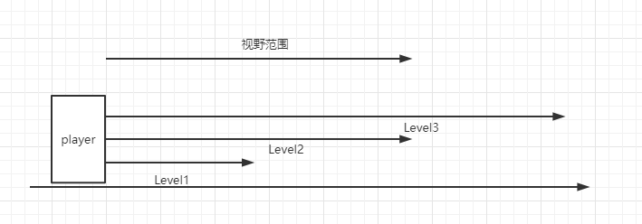

## 1.AOI优化

AOI优化比较贴近代码逻辑优化，优化思想可以用于业务逻辑的优化。

### AOI概念

Area of Interest 兴趣范围

要了解AOI首先得了解游戏中的广播类型：

-   全服广播
-   地图广播
-   社交广播
-   交互目标
-   玩家自身

AOI实质是广播给需要关注的对象，不需要关注的不广播。

在地图消息同步中，同步给自身位置周围的对象，而非全地图广播。

假如一张地图100人，那每秒同步数：

-   100\*100 = 10000
-   1s同步10次
-   1s = 100000次消息处理
-   \~3MB/s(Bytes) = 24Mb/s(bit)
-   100人：2400Mb/s（家里才100Mb/s）

服务器消息分发压力大，所以要做AOI优化。

AOI解决的问题：

-   建立兴趣范围清单
-   只对兴趣范围内的目标广播
-   极大的降低消息处理压力与网络负载

### AOI设计

设计的原则

分析核心需求

-   减少压力消耗
-   降低带宽
-   提高负载

明确设计目标（输出的东西）

-   兴趣范围规划方案
-   对象
-   数据
-   算法

不为设计而设计（参考被人的方案要反推方案解决的痛点，借鉴来制定适合自己的改造方案）

-   优化思想
-   忘记技术
-   不忘初心

#### 场景分析与方案设计（一）

区域划分：以玩家为中心，设定距离级别范围



| Level | 兴趣（预加载） | 同步基本数据（血量、属性等） | 同步状态（移动，动作） |
| ----- | -------------- | ---------------------------- | ---------------------- |
| 1     | Y              | Y                            | Y                      |
| 2     | Y              | Y                            |                        |
| 3     | Y              |                              |                        |

伪代码
```
void OnEntityMove(who) { 
    foreach (var entity in entities) { 
        if (who == entity) continue; 
        bool nowInAOI = who.Distance(entity) \< who.AOIRange; 
        bool alreadyInAOI = who.AOI.contains(entity); 
        if (alreadyInAOI && !nowInAOI ) { 
            who.onLeaveAOI(entity); 
            entity.onLeaveAOI(who); 
        } 
        if (!alreadyInAOI && nowInAOI) { 
            who.onEnterAOI(entity); 
            entity.onEnterAOI(who); 
        } 
    } 
}
```
优点

-   不需要特殊的数据结构
-   易于实现

缺点

-   计算成本较高(1+N)\*N/2

#### 改善方案（适用来降低cpu计算压力）

-   多线程
    -   并行计算，提升计算效率。要主要线程间的切换消耗，所以不是成倍提效。
-   延迟计算
    -   增大计算间隔，不用每帧都计算AOI，可以1秒执行一次。
-   分配计算
    -   100/Frame。每帧计算100人，1000人就是10帧算完。

#### 场景分析与方案设计（二）

区域划分：将地图分成一个个方格。

伪代码：
```
void OnEntityMove(who) { 
    int new_x = (int)(who.position.x/size); 
    int new_y = (int)(who.position.y/size); 
    if(new_x!=who.grid_x \|\| new_y!=who.grid_y) { 
        who.LeaveAOI(who.grid_x, who.grid_y); 
        who.EnterGrid(new_x, new_y); 
        who.grid_x = new_x; 
        who.grid_y = new_y; 
    } 
}
```
优点：

-   计算速度快

缺点：

-   需要额外数据结构（一维数组）存储格子信息
-   需要额外的格力管理逻辑
-   实现复杂度高
-   格子边界问题

#### 方案设计（三）

解决格子边界问题：九宫格、16宫格、25宫格

#### 进一步的优化思考

-   方案的组合：方案一与方案三结合
-   算法优化
    -   优化数据结构
    -   降低运算消耗
-   ECS架构（DOTS）
    -   采用面向数据概念优化架构，提升运算性能
-   并行运算与GPU加速
    -   利用并行计算提升性能（GPU Instance）
    -   采用GPU加速减少CPU消耗

勿忘初心，适合而至，避免过渡优化。性能优化曲线是先快后慢，只追求80%就行，得将讲究**性价比**。

### 优化案例

**背景：**单服10000个角色，1000\*1000的地图，角色间距离为10时有效。 使用最简单的双向查找算法，两重For循环，每找到一个时数量+1，找到40030个有效值时，耗时**880ms。**

**优化一：**

位置是双向的，A、B都在范围内只需计算一次，即一共n\*（n-1）/2次，优化后耗时**416ms**。

**优化二：**

大部分角色相对较远，对地图重新分区，为100\*100，对区域内和边界上的player计算距离。**22.5ms**。

**优化三：**

区域大小用2\^N来表示，使用移位出来处理计算角色所在区域，使用64大小区域。**15.5ms**。

**优化四：**

从算法的耗时来看，区域小一些，则区域数量变多，但每个区域内角色少了，计算量也就少了，所以改用32区域大小。耗时**9.5ms**。

**优化五：**

地图变大一些，角色更加稀疏，则计算量就更少，使用10000\*10000的地图后，同样64大少的区域，耗时**1.8ms**。
