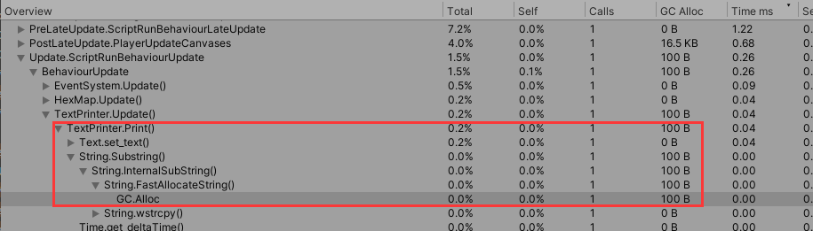
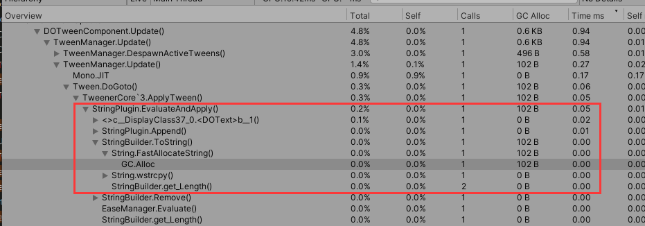

# 缓动效果

缓动效果不得不提的一个库：DoTween。

*   [文档](http://dotween.demigiant.com/documentation.php "文档")

*   [github](https://github.com/Demigiant/dotween "github")

> 网上有很好总结DoTween库的[使用篇](https://zhuanlan.zhihu.com/p/525880609 "使用篇")、[源码分析篇](https://blog.csdn.net/fdyshlk/article/details/80031574 "源码分析篇")

## 1.文字打印机

有两种方法可以做：

1.在Update里面用substring每帧赋值给Text组件

2.使用DoTween的DoText方法

&#x20;发现两个方法在每帧造成的内存垃圾（substring）都不小，DoTween或者较严重。

doTween使用stringBuilder来装载string，但tostring返回的过程调用的是String类创建字符串的基础方法FastAllocateString，最后还是会造成内存垃圾。

改进方向可以是**减少substring的数量**，把**步长增大**，每帧增多几个字符而不是一个字符。

假如效果一卡一卡衔接不好，可以加快速度解决。
