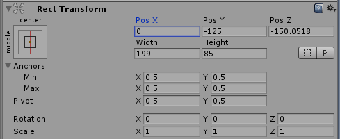

# position、localPosition、anchoredPosition

RecTransform上的Position实际是anchoredPosition，是轴心点pivot相对于anchors（四个三角形聚合为一点时）的位置

localPosition是pivot相对于父节点的pivot的位置。

自己的localPosition与所有父节点的localPosition相加是等于position。

[https://zhuanlan.zhihu.com/p/114829066](https://zhuanlan.zhihu.com/p/114829066)

