# dudou jump小游戏

## 一.功能拆分

1. 小人弹跳实现
2. 关卡的生成算法
	地图无缝衔接
	跳板类实现：普通、单次、移动
3. 道具的实现：弹簧、热气球、地刺、金币
4. 金币掉落

## 二.技术点实现

### 1.小人弹跳设计

弹跳公式使用重力公式：s=vt+0.5gt^2。

实际上发现效果轻飘飘的，玩家手感不好。查阅到这篇文章：[跳跃设计与实现](https://nofootbird.wordpress.com/2011/06/18/游戏里面跳跃的设计和实现心得/)。

里面指出：手感好坏与玩家不可控时间的长短有重要关系，减少不可控时间，能增强手感。

所以在设计跳跃中，分为上升和下落两部分，下落重力是上升的n倍(n>1)。

通过增大下落时重力来缩短下落时间。

右边是优化前的，左边是优化后的，左边的明显右边左边更加有重力感。

另外推荐有关公式推导文章和工具：

- [游戏中跳跃函数图像的推导应用](https://blog.csdn.net/zgjllf1011/article/details/79221819)
- [图形计算器：函数图像绘制工具](https://www.geogebra.org/graphing?lang=zh_CN)

### 2.地图移动

小人上跳的镜头移动实质是移动地图造成的视觉效果，下面是跳跃位移示图。

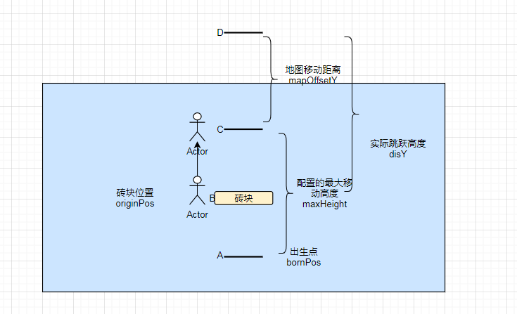

小人最高只会跳到C点，剩余高度会转移成地图移动距离mapOffsetY。

还有一点要注意的是，下落时需要算出从最高点D的下落距离，C点减去下落距离才是小人下落的位置。

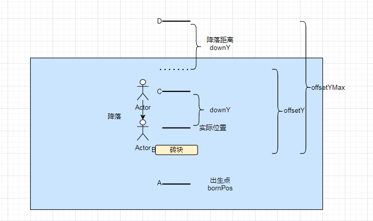

`downY = offsetYMax-offsetY;`

`posY = bornPos.y + maxHeight - downY；`

### 3.碰撞检测

使用BoxCollider2D和Rigidbody2D实现碰撞检测，勾选isTrigger，监听OnTriggerEnter事件。spine对象挂在player组件下。

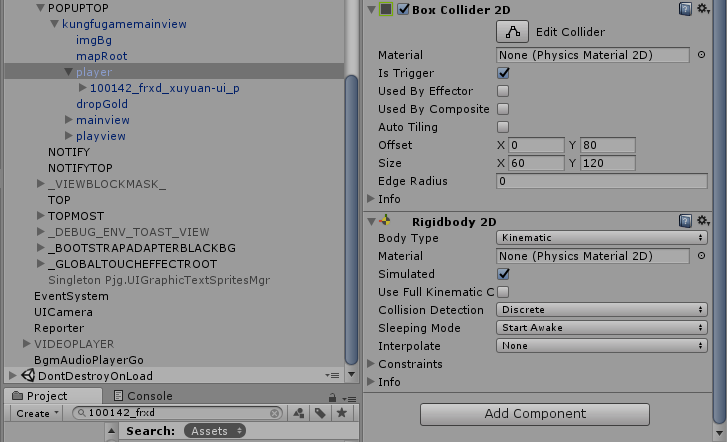

对于碰撞盒跟随spine这点要注意，游戏设定判断小人只有在下落时候才能与装块碰撞，当碰撞盒位于小人初始位置时会在上跳时，会出现小人动画跳上装块但碰撞盒没有跳上则没有触发OnTriggerEnter事件的问题。

这里调整下碰撞盒的位置来简单解决。

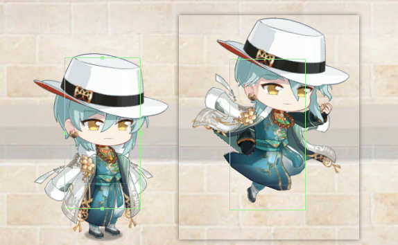

还有一个常用的解决方法：将碰撞盒挂载在spine挂点上，碰撞盒就能随挂点移。

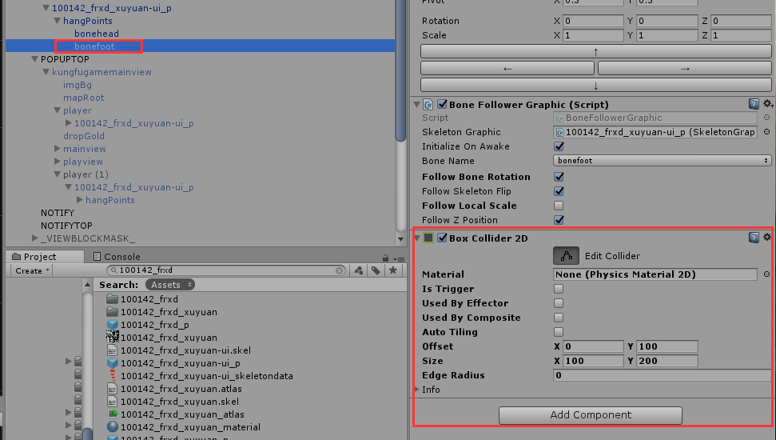

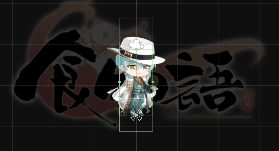

这个方法要在bonefoot节点上另外挂脚本监听OnTriggerEnter事件。

上面的调整固定碰撞盒位置方法比较简单，而且效果也差不多所以选用了。

### 4.道具交互

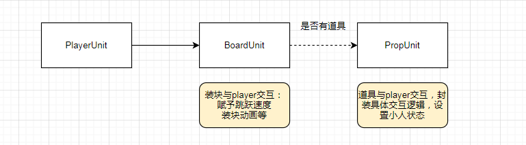

这里值得注意的是，道具对player的状态比较大，特别是热气球这种道具，与player结合并且失效时机依赖定时器，所以必须处理好像游戏时间结束这种突然中断的情况，重置好player状态和清除定时器。

## 三.坑点注意

### 1.位置检测中的分辨率适配问题

检查位置是否脱离屏幕外，不能拿canvasHeight和ScreenHeight去判断，要用PopupHeight。

因为像Ipad屏2160*1620，实际的可显示区域只有Popup区域：

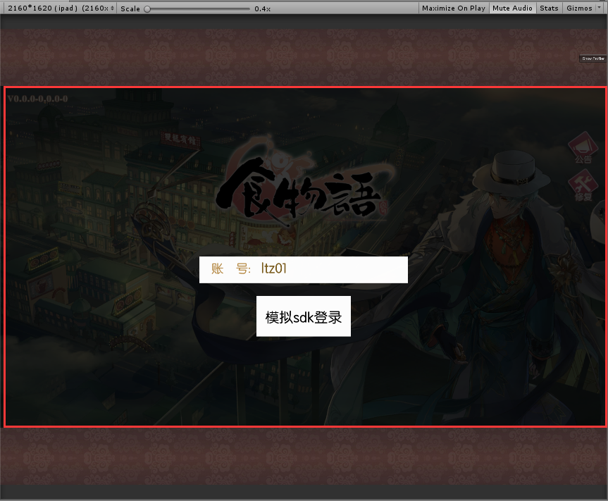

### 2.调整了pivot和anchors位置后，设置localPosition与预期不符

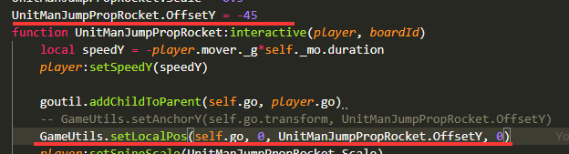

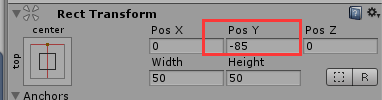

道具gameObject的pivot改为（0.5,0）底下位置，anchors改为（0.5,1）中顶上位置，预期是PosY为-45，结果是-85。

查了资料和结合实践，localPosition设置位置是轴心pivot相对于父节点轴心的位置。

RectTransform有属性anchoredPosition，官方关于anchoredPosition的解析：

> 此 RectTransform 的轴心相对于锚点参考点的位置。

锚定位置是考虑锚点参考点的 RectTransform 轴心位置。 锚点参考点是锚点的位置。如果锚点不在一起，则 Unity 会使用轴心位置作为参考来估算四个锚点位置。

但锚点为一个点时，anchoredPosition是轴心相对锚点的位置。

### 3.对象池管理–对象被重复回收

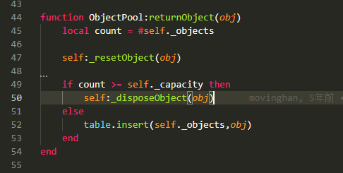

对象池类的回收机制里并没有去重，当容量足够，就往里面放对象，不管这个对象是否已经在对象池中了。

所以回收对象在游戏不止一处使用时，必须注意不要重复回收。或者继承对象池类复写returnObject放些去重逻辑。

### 4.当消息事件注册太多时，注意取消订阅时机

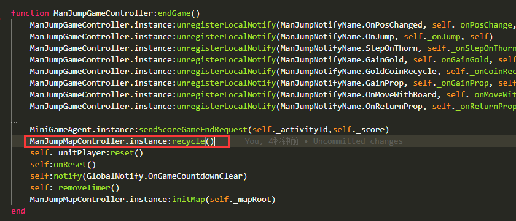

红框这句代码做的事情就是回收对象，由于封装太多层的原因，疏忽大意在回收对象时发出了上面注销事件消息，导致无响应。

而且代码封装太多层会导致排查有点困难。

注销事件代码后面还有逻辑的话，需要注意后面逻辑有没有发了注销事件的消息。这里将注销事件代码移到后面执行。

