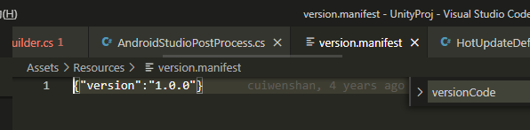
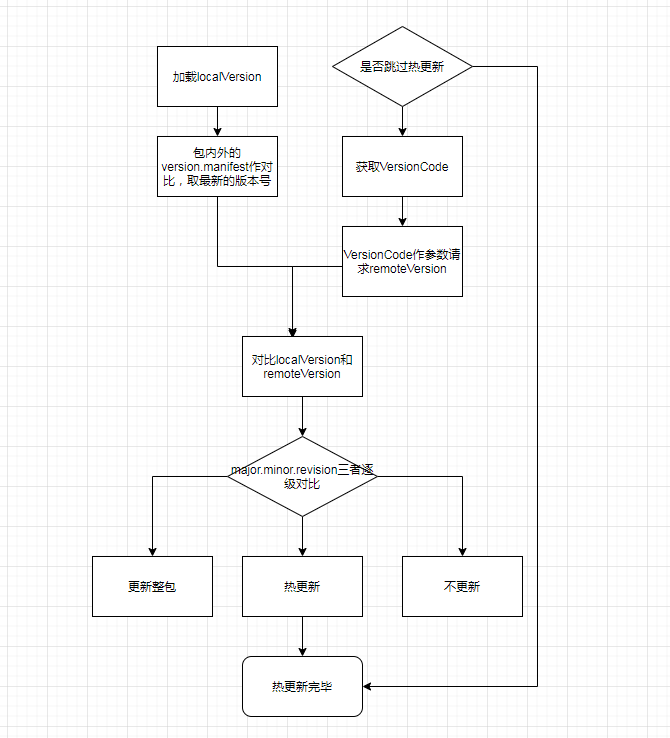
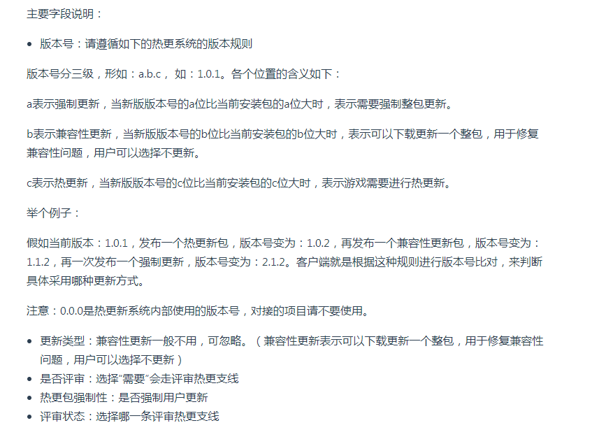
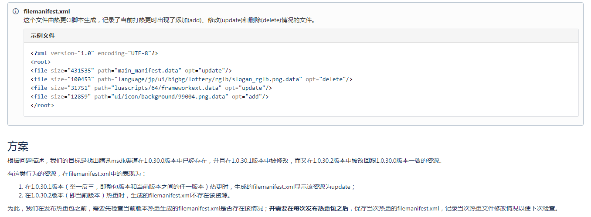

# 游戏热更新

## version数据解析

在本地打包时会有跳过热更新或者测试热更新的需求，但没有文档解析打包界面version相关选项的作用，也不知道登录界面版本字符串的含义，所以这篇文章对打包过程的version相关参数和选项作详细解析，以及简单讲解游戏包更新流程。


### 参数解析

- Build Package的Version：仅用作展示，作为游戏登录界面的版本字符串的一部分。
- Build Package的VersionCode：作为GameConst.txt里的NativeVersionCode，用来更新包外的GameConst.txt。当包内与包外的GameConst里的NativeVersionCode不同时，会覆盖外部GameConst.txt文件。另一个作用是作为请求remoteVersionManifest文件获取最新版本号的参数。
- 游戏常量配置的游戏是否启用热更新：对应GameConst.txt的gameOpenHotUpdate字段，可以忽略Version而跳过热更。


- 登录界面的版本字符串分为MSDK和非MSDK格式，区别就是MSDK格式多了腾讯热更版本号，对游戏更新逻辑没影响。
	- MSDK格式：V{msdkVersion}-{LocalVersion}-{VersionName}-{VersionCode}
	- 非MSDK格式：V{LocalVersion}-{VersionName}-{VersionCode}

LocalVersion用于对比remoteVersion决定更新，VersionName对应Build Package的Version，VersionCode对应Build Package的VersionCode。

LocalVersion的值记录于Assets\Resources\version.manifest文件中



## 更新流程



版本号a.b.c各级的作用：



## 热更线程代码

[DownloadThread.cs](file/DownloadThread.cs)

```C#
// downloadFile用子线程实现，new Thread(new ThreadStart(RunDownloading))
class DownloadThread
{
  public void Start()
  {
      if (!_isStop || _thread != null)
      {
          CLogger.Log("DownloadThread::Start() - Download Thread Already Started:" + !_isStop + "#thread:" + ((_thread == null) ? "null" : _thread.ManagedThreadId.ToString()));
          return;
      }
      _isStop = false;
      _thread = new Thread(new ThreadStart(RunDownloading));
      CLogger.Log("DownloadThread::Start() - Create Download Thread:" + _thread.ManagedThreadId);
      _thread.IsBackground = true; // 设置为后台线程，确保当主线程退出时该线程也会结束
      _thread.Start();
  }
  
   private void RunDownloading()
        {
            for (; ; )
            {
                if (_isStop)
                {
                    CLogger.Log("DownloadThread::RunDownloading() - Download Thread Meet Stop Flag,ThreadId:" + Thread.CurrentThread.ManagedThreadId);
                    break;
                }
                if (_currentTask == null)
                {
                    lock (_pendingTasks)
                    {
                        int num = _pendingTasks.Count;
                        if (num > 0)
                        {
                            _currentTask = _pendingTasks.Dequeue();
                        }
                        else
                        {
                            _isWaitting = true;
                            this.Wait();
                            _isWaitting = false;
                        }
                    }
                }

                if (!_isStop && _currentTask != null)
                {
                    //Debug.Log ("StartDownload");
                    // 开始断点续传下载文件
                    DownloadFromBreakPoint(_currentTask);
                    //Debug.Log ("EndDownload");
                }
            }
        }

```


lock关键字

IEquatasble [https://www.cnblogs.com/lian--ying/p/9502879.html](https://www.cnblogs.com/lian--ying/p/9502879.html)

### C#多线程编程

[http://images.china-pub.com/ebook4610001-4615000/4613657/ch01.pdf](http://images.china-pub.com/ebook4610001-4615000/4613657/ch01.pdf)

[http://apps.mxinfos.com/电子书籍/多线程编程.pdf](http://apps.mxinfos.com/电子书籍/多线程编程.pdf)

### 断点续传

下载热更文件使用了**断点续传**，原因是当下载大文件中途断网或退出时，可以保证下次更新在上次下载进度基础上继续正常下载。

断点续传需要服务端支持，需支持允许分段方式请求的文件数据。

使用http协议头字段range告知服务器下载文件字节数据范围值，例如：range:bytes=500-1000。配合If-Range:Etag/if-modified判断文件是否发生变化。详细看考这篇[文章](https://www.jianshu.com/p/e8dee3dbc409)。

```C#
// 关键代码
if (File.Exists(task.storagePath))
{
    // 1.从已下载部分数据的文件统计已下载字节数、剩余下载字节数
    using (FileStream fileStream = new FileStream(task.storagePath, FileMode.OpenOrCreate, FileAccess.ReadWrite, FileShare.ReadWrite))
    {
        receivedLength = fileStream.Length;
        toDownloadLength = totalLength - receivedLength;
        fileStream.Close();
    }

    if (receivedLength != dfi.receivedSize)
    {
        CLogger.Log(string.Format("DownloadThread::DownloadFromBreakPoint() - break point save receive size is wrong for file[{0}], saveSize={1}, fileSize={2}", _currentTaskFileName, dfi.receivedSize, receivedLength));
    }
}
task.fileLength = totalLength;
task.receivedLength = receivedLength;
_currentTaskTotalBytes = totalLength;
_currentTaskReceivedBytes = receivedLength;

bool transferOkay = true;
if (toDownloadLength > 0L)
{
    CLogger.Log("DownloadThread::DownloadFromBreakPoint() - start http download, The request url is [" + uri + "] with range [" + receivedLength + "," + totalLength + "]");

    HttpWebRequest request2 = (HttpWebRequest)WebRequest.Create(uri);
    request2.Timeout = kTimeOut;
    request2.KeepAlive = true;
    request2.ReadWriteTimeout = kTimeOut;
    request2.AddRange((int)receivedLength, (int)totalLength);

    HttpWebResponse response2 = (HttpWebResponse)request2.GetResponse();
    transferOkay = this.ReadBytesFromResponse(task, response2);
    response2.Close();
    request2.Abort();
}
if (transferOkay)
{
    this.OnDownloadFinished(task, null);
}

// 2.读取数据存储进文件
private bool ReadBytesFromResponse(DownloadTask task, WebResponse response)
{
    bool okay = false;
    DownloadFileTransferInfo fileInfo = _transferMgr.GetDownloadFileInfo(task.file);
    FileUtils.Instance.CheckDirExistsForFile(task.storagePath);

    using (FileStream fileStream = new FileStream(task.storagePath, task.receivedLength == 0 ? FileMode.Create : FileMode.OpenOrCreate, FileAccess.ReadWrite, FileShare.ReadWrite))
    {
      // 3.设置文件流的起始指针为已收到的字节大小
      fileStream.Position = task.receivedLength;
      byte[] array = new byte[1024];
      using (Stream responseStream = response.GetResponseStream())
      {
          int bytesRead = 0;
          while (task.receivedLength < task.fileLength)
          {
              // 4.读写流把数据从respone体中读出并写入到目标文件中
              bytesRead = responseStream.Read(array, 0, array.Length);
              fileStream.Write(array, 0, bytesRead);
              task.receivedLength += bytesRead;
              _currentTaskReceivedBytes = task.receivedLength;

              _transferMgr.UpdateFileTransferProgress(fileInfo, task.receivedLength);
          }

          okay = true;
      }

      if (task.receivedLength != task.fileLength)
      {
          string s = string.Format("DownloadThread::ReadBytesFromResponse() - Download length not fit Error:{0}/{1}", task.receivedLength, task.fileLength);
          CLogger.LogError(s);
          okay = false;
          this.OnDownloadFinished(task, new Exception(s));
      }
    }

    return okay;
}

```


上面断点续传的是ab文件，下面续传zip文件：

[BreakpointTransferZip.cs](file/BreakpointTransferZip.cs)

## 热更包与基线

### 热更文件检出

热更包的资源文件通过对比两个版本的资源变更情况得出

用git对比？选出具有相同目录结构文件？

网上的一般方式是用**MD5**检出变更的文件，服务器会下发最新版文件的MD5信息，用之和本地文件MD5对比。

应不用选出具有相同目录结构的文件包，服务端会下发热更文件的相对存储路径。

### 百田热更基线与腾讯热更基线


但是腾讯的热更基线逻辑会存在问题：比如整包版本V0中的资源A，在版本V1修改，在版本V2中被回滚回V0版本，这时打V2热更包时将检测不出资源A，那么V1版本升V2版本后资源A依然停留在V1版本。

解决办法：使用热更生成的filemanifest.xml来判断是否有文件被回滚



基线怎么来呢？

很简单，记录上一次打包的所有ab到cache文件即可。百田热更基线记录abCache的时机为每次发热更包后，腾讯的则是发整包版本后。


