# TextMeshPro

指标

1.中文及多语言的支持（简体、繁体、日语）

各种字体创造常用文字的SDF文字

创建没有的文字，Dynamic SDF System在Untiy2018.3 TMP1.4版本之后才推出，但可以使用Font Fallback追加包含缺失文字的SDF Asset。

代码使用：

导出TextMeshPro类 √

```C#
// LocalExportLuaSetting.cs
_GT(typeof(TMPro.TextMeshPro)),
_GT(typeof(TMPro.TextMeshProUGUI)),

```


lua获取TMP组件，然后赋值 √

```Lua
-- goutil.lua
goutil.Type_TMPUGUI = typeof(TMPro.TextMeshProUGUI)
goutil.Type_TMP = typeof(TMPro.TextMeshPro)
function goutil.findChildTMPUGUIComponent(container, childName)
  return goutil.findChildComponent(container, childName,goutil.Type_TMPUGUI);
end

function goutil.findChildTMPComponent(container, childName)
  return goutil.findChildComponent(container, childName,goutil.Type_TMP);
end

-- 赋值
local tmpUGUIText = goutil.findChildTMPUGUIComponent(container, childName)
tmpUGUIText.text = "你好"
local tmpText = goutil.findChildTMPUGUIComponent(container, childName)
tmpText.text = "你好"
```


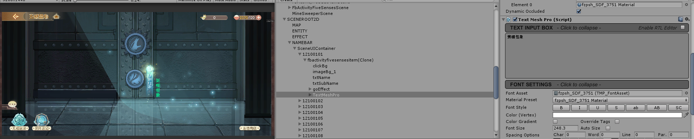

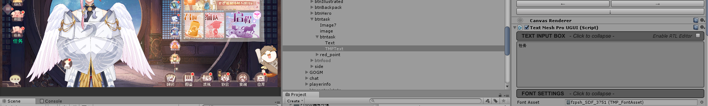


2.资源打包与读取

分析tmp相关资源有哪些，单独添加的就单独打ab，shader这些要想一下。

tmp文件夹移动到threepath下

分离出需要热更的文件

Resources/Fonts & Materials → GameAssets/textmeshpro/fonts&materials

Resources/shaders → gameasssets/textmeshpro/shaders

Resources/sprite Assets → gameasssets/textmeshpro/spriteassets

Resources/style sheets → gameasssets/textmeshpro/stylesheets

Sprites → gameasssets/textmeshpro/sprites

**问题**：

1.sprites Assets和style sheets在哪里被引用，该如何放置资源，用哪种策略打包资源。

sprites Assets和style sheets在TMP Setting中配置引用，这两部分可以放在GameAssets目录下单独打包。

2.tmp setting加载被代码固定加载位置，无法移除Resources文件夹。

反射？


3.热更新

3.1新增文字→热更font asset，做个热更测试demo

新增文字热更测试:新增文字，重新生成font asset，打出相关ab后，模拟热更更新ab。

3.1.1失之东隅，收之桑榆。——范晔


重新生成fzpsh_sdf_3751_fallback

在font asset creator面板上Character Set选择Custom Characters。选择fzpsh_sdf_3751_fallback，里面的文字就会出现在下面，补上缺失的文字和文字来源的字体文件（选择包含缺失文字的字体即可）。

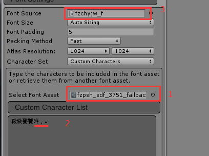

保存生成的font asset覆盖之前的fzpsh_sdf_3751_fallback。

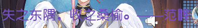

3.1.2重新打ab。

热更包包含：

 main_manifest.data

main_manifest.data.manifest 

/language/zh/ui/views/main/mainview.prefab.data

/language/zh/ui/views/main/mainview.prefab.data.manifest

/textmeshpro/fonts&materials/fzpsh_sdf_3751_fallback.asset.data

/textmeshpro/fonts&materials/fzpsh_sdf_3751_fallback.asset.data.manifest

3.1.3 热更成功。“失之东隅，收之桑榆。——范晔”这句话正常显示。


3.2新增效果→热更metarials和shaders，做个热更测试demo

3.2.1修改fzpsh_sdf_3751-glow.mat材质

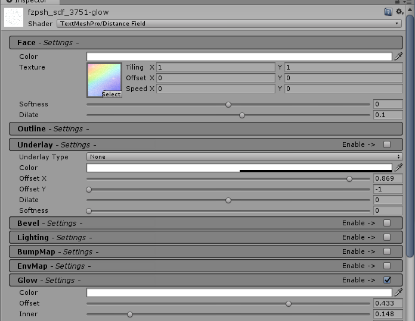

更改组件的material preset属性为fzpsh_sdf_3751-glow

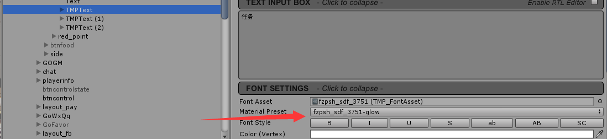

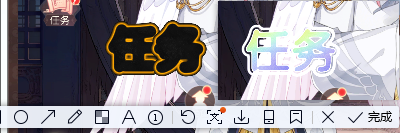

3.2.2重新打ab。

热更包包含：

 main_manifest.data

main_manifest.data.manifest 

/language/zh/ui/views/main/mainview.prefab.data

/language/zh/ui/views/main/mainview.prefab.data.manifest

/textmeshpro/fonts&materials/fzpsh_sdf_3751-glow.mat.data

/textmeshpro/fonts&materials/ffzpsh_sdf_3751-glow.mat.data.manifest

3.2.3 热更成功.效果显示是更改后的。**有个问题就是文字glow效果在手机上没有显示出来。**


**问题：**

1.打整包情况下不显示应用了非默认metarials和shaders的文字

重新打包显示了

2.打整包后进入游戏看到应用了非默认material preset的字体效果跟Editor上的有差别，仅查看mainview prefab，效果正常。

非默认material preset使用了glow（发光）属性，手机上动态加载后不起作用，但假如将界面直接加在场景下，与场景一起加载，glow效果无问题。


4.检出游戏内的文字没有被包含在3500常用汉字里的有哪些？

写了一段程序统计多语言language表中的所有文字中，不包含在常用3500汉字里面的数据：

```Lua
-- LangMgr.lua

local function readFile(filename)
  local f = assert(io.open(filename, "r+"))
  local content = f:read("*all")
  f:close()
  return content
end

function LangMgr:statTMPCharCoverage()
  if not self._charDict then
    self._charDict = {}
  end
  local filename = "Assets/Scripts/Lua/logic/common/lang/common-zh-char-3500.txt"
  -- local filename = "Assets/Scripts/Lua/logic/common/lang/中文命名-3500.txt" --lua io.open 搜索不到中文命名文件
  local content = readFile(filename)
  local charList = GameUtils.getUCharList(content)
  local total = 0
  for i = 1, #charList do
    if not GameUtils.isEmptyString(charList[i]) then
      self._charDict[charList[i]] = 1
      total = total+1
    end
  end
  local missCharNum = 0
  local missCharDict = {}
  for i, languageConfigName in ipairs(self:_getLanguageConfigNames()) do
    local languageTable = self[languageConfigName]
    if languageTable then
      for i,item in ipairs(languageTable.dataList) do
        local itemCharList = GameUtils.getUCharList(item.contentzh)
        if GameUtils.isTable(itemCharList) and next(itemCharList) then
          for _,char in ipairs(itemCharList) do
            if not self._charDict[char] and not missCharDict[char] then
              -- 过滤掉数字和英文字母
              -- string.byte:a-97,z-122,A-65,Z-90,0-48,9-57
              local itor = string.gmatch(char, "[%z\48-\57\65-\90\97-\122]*")
              if GameUtils.isEmptyString(itor()) then
                missCharNum = missCharNum+1
                missCharDict[char] = 1
              end
            end
          end
        end
      end
    end
  end
  local missCharList = {}
  for char,_ in pairs(missCharDict) do
    table.insert(missCharList, char)
  end
  local log = "TMP字符覆盖率统计：\n常用汉字数：%d个\n统计游戏中所有文字，常用汉字不包含字符有：%d,如下\n%s"
  printWarn(string.format(log, total, missCharNum, table.concat(missCharList, "")))
end 
```


LangMgr管理多语言language表的加载，游戏启动时候执行上面函数输出结果：

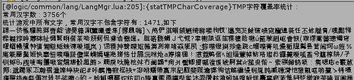

除开数字和英文字母，游戏所有中文字符不被常用汉字文件包含的字符有1471个。

拷贝这1471个字符，到font asset Creator面板生成新的font asset。character set选择Custom Characters，font source选择项目常用的fzpsh.ttf文件，生成结果如下：

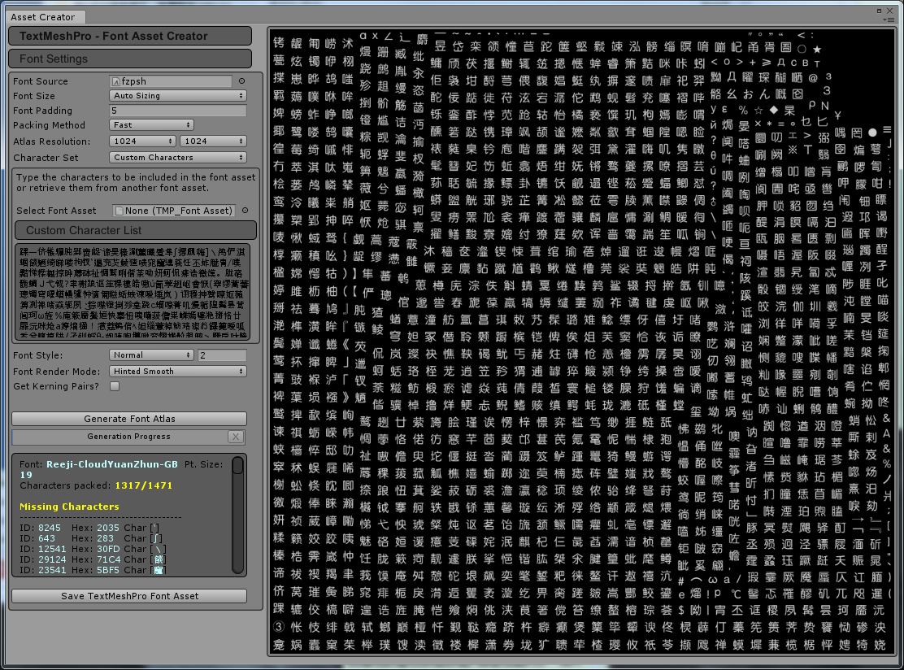

还存在有164个字符不被包含，原因是没有从源字体文件fzpsh.ttf中找到字符对应的unicode的索引，简单来说源字体中没有这些字符。


5.性能（cpu/gpu/内存）问题


路线：

**1.能实现什么效果**

1.1文字大小缩放后对比UGUI text更清晰

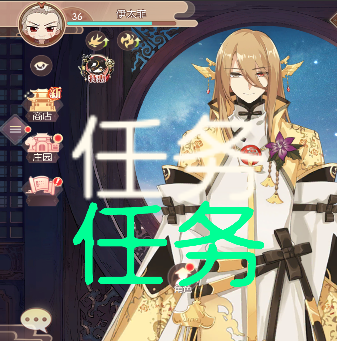

1.2文本排版，图文混排、富文本和各种样式标签支持相对友好

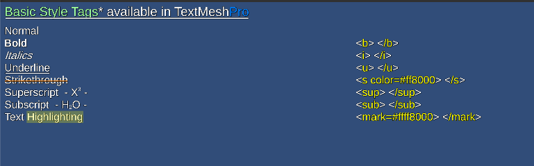

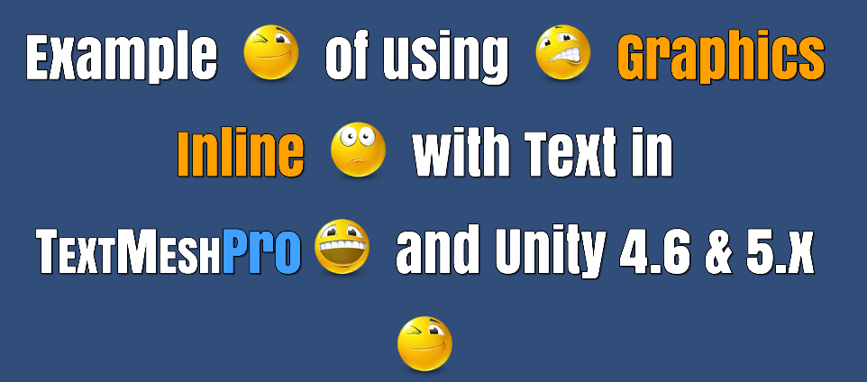

1.3文字动效


1.4使用材质实现各种效果


这个效果UGUI并不能简单实现，而使用tmp却可以轻松搞定。

**2.原理**

**3.引入**

[TMP使用引导](https://docs.unity3d.com/Packages/com.unity.textmeshpro@2.2/manual/index.html)

[API文档](http://digitalnativestudios.com/textmeshpro/docs/)

[TMP Unity论坛](https://forum.unity.com/forums/ugui-textmesh-pro.60/?_ga=2.72243415.531476787.1632734182-77459905.1586488263)

2017没有packagemanager，引入TMP需要拷贝。

两个组件，TextMeshPro替代TextMesh，添加通过*GameObject->3D Object->TextMeshPro Text*

第二组件TextMeshProUGUI替代UI.Text，添加通过*GameObject->UI->TextMeshPro Text*


引入资源包：TMP Essential Resources。需要需要例子可以同时导入：TMP Examples and Extras

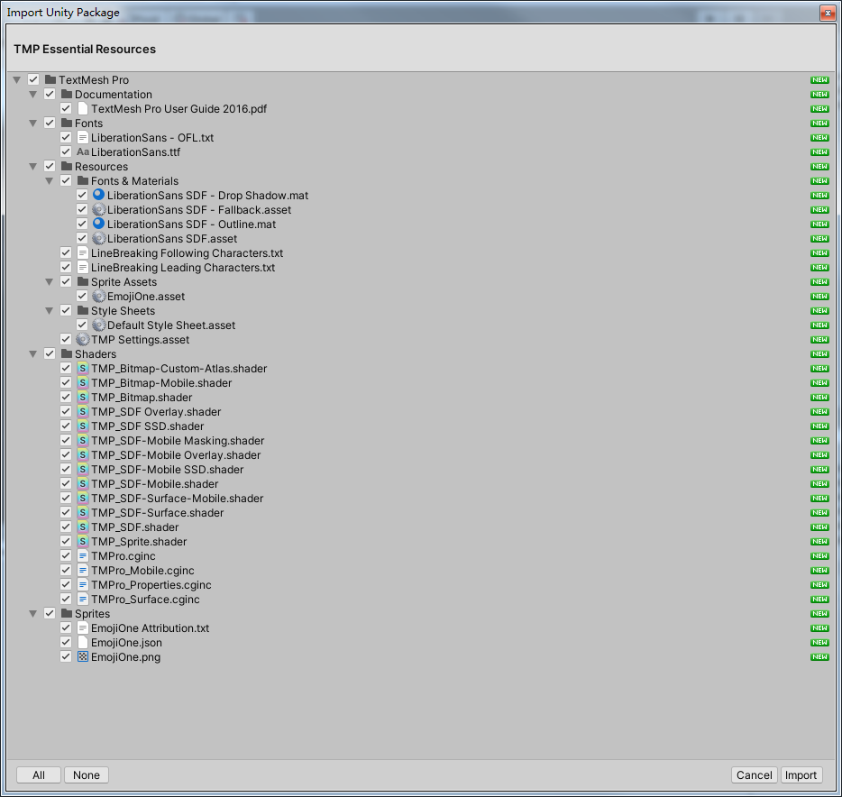

有些资源引入线上项目时可以考虑删除，比如Emoji资源。


字体文件+不同的mat文件=各种字体效果

问题：字体文件如何生成，搭配的mat材质文件如何生成？

1. 中文或其他语言字符需要创建Font Asset
2. window》Font Asset Creator

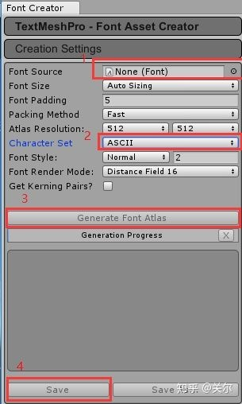

3.Font Source：选择中文字体，如何黑体、宋体等

4.Character Set：选择characters from File

5.character File：选择常用汉字库3500.txt，因为中文文字太多，计算SDF会很耗时。

6.点击Generate Font Altas，观察有没有丢字（font source文件里有没有包含这个字），最后保存。


生成TMP Sprites Asset的方法：

1.打开TMP windows→sprite Importer

2.sprite data source：必填，sprite数据源，来自使用[Texture Packer](https://forum.unity.com/threads/texturepacker-importer-spritesheet-generator-sprite-mesh-optimizer.367738/)设置好图集后使用JSON Array格式导出。

3.Import Format：导入格式，选择texture packer

4.sprite texture altas：选择打好的sprite图集

5.点击创建sprite asset


注意

The primary and fallback font assets would typically use the same source font file as well as same Ratio of Sampling Point Size to Padding to make sure Material Presets match visually.

主要和备用字体资产通常会使用**相同的源字体文件**以及**相同的采样点大小与填充的比率**，以确保材质预设在视觉上匹配。


